# PDLC — Product Development Lifecycle

A Claude Code plugin that guides small startup-style teams (2-5 engineers) through the full arc of feature development — from raw idea to shipped, production feature — using structured phases, a named specialist agent team, persistent memory, and safety guardrails.

PDLC combines the best of four Claude Code workflows:
- **[obra/superpowers](https://github.com/obra/superpowers)** — TDD discipline, systematic debugging, visual brainstorming companion
- **[gstack](https://github.com/garrytan/gstack)** — specialist agent roles, sprint workflow, real browser automation
- **[get-shit-done-cc](https://github.com/gsd-build/get-shit-done)** — context-rot prevention, spec-driven execution, file-based persistent memory
- **[bmad-method](https://github.com/bmadcode/bmad-method)** — adversarial review, edge case analysis, divergent ideation, multi-agent party mode

---

## Table of Contents

1. [Installation](#installation)
2. [Quick Start](#quick-start)
3. [The PDLC Flow](#the-pdlc-flow)
4. [Feature Highlights](#feature-highlights)
5. [Phases in Detail](#phases-in-detail)
6. [The Agent Team](#the-agent-team)
7. [Party Mode](#party-mode)
8. [Deadlock Detection](#deadlock-detection)
9. [Skills Architecture](#skills-architecture)
10. [Memory Bank](#memory-bank)
11. [Safety Guardrails](#safety-guardrails)
12. [Status Bar](#status-bar)
13. [Visual Companion](#visual-companion)
14. [Design Decisions](#design-decisions)
15. [pdlc-os Marketplace](#pdlc-os-marketplace)
16. [Requirements](#requirements)
17. [License](#license)

---

## Installation

### Option A — npx (no global install)

```bash
npx @pdlc-os/pdlc install
```

### Option B — global npm install

```bash
npm install -g @pdlc-os/pdlc
pdlc install
```

### Option C — directly from GitHub (always latest)

```bash
npm install -g pdlc-os/pdlc
pdlc install
```

Pin to a specific release tag:

```bash
npm install -g pdlc-os/pdlc#v0.1.0
pdlc install
```

### Option D — clone and install

```bash
git clone https://github.com/pdlc-os/pdlc.git
cd pdlc
node bin/pdlc.js install
```

All options register PDLC's hooks and status bar in `~/.claude/settings.json`. Start a new Claude Code session to activate.

### Verify installation

```bash
npx @pdlc-os/pdlc status
```

### Uninstall

```bash
npx @pdlc-os/pdlc uninstall
```

### Keep up to date

```bash
# From npm
npx @pdlc-os/pdlc@latest install

# From GitHub (latest main)
npm install -g pdlc-os/pdlc && pdlc install
```

Re-running `install` is idempotent — it strips old hook paths and re-registers with the current version.

### Prerequisites

| Dependency | Install |
|-----------|---------|
| Node.js >= 18 | [nodejs.org](https://nodejs.org) |
| Claude Code | [claude.ai/code](https://claude.ai/code) |
| [Beads (bd)](https://github.com/gastownhall/beads) | `npm install -g @beads/bd` |
| Git | Built into macOS/Linux |

---

## Quick Start

Once installed, open any project in Claude Code:

```
/init
```

PDLC asks 7 questions about your project (tech stack, constraints, test gates) and scaffolds the full memory bank. Then start your first feature:

```
/brainstorm user-authentication
```

Work through Inception (discovery, PRD, design, plan), then:

```
/build
```

Build, review, and test the feature with TDD and multi-agent review. When ready:

```
/ship
```

Merge, deploy, reflect, and commit the episode record.

---

## The PDLC Flow

```mermaid
flowchart TD
    START([Session Start]) --> RESUME{STATE.md exists?}
    RESUME -->|No| INIT
    RESUME -->|Yes| AUTOLOAD[Auto-resume from last checkpoint]
    AUTOLOAD --> PHASE_CHECK{Current phase?}
    PHASE_CHECK -->|Inception| INCEPTION
    PHASE_CHECK -->|Construction| CONSTRUCTION
    PHASE_CHECK -->|Operation| OPERATION

    %% ── PHASE 0: INIT ──────────────────────────────────────────────
    INIT["/init"] --> PREREQ[Check prereqs\nbd + git]
    PREREQ --> FIELD{Existing code?}
    FIELD -->|Brownfield| SCAN[Offer repo scan\nskills/repo-scan]
    SCAN -->|Accepted| SCANRUN[Deep-scan codebase\nPresent findings for approval]
    SCANRUN --> MEM
    SCAN -->|Declined| SOC
    FIELD -->|Greenfield| SOC[7 Socratic questions\nor type skip to proceed early]
    SOC --> MEM[Generate memory files\nCONSTITUTION · INTENT · STATE\nROADMAP · DECISIONS · CHANGELOG · OVERVIEW]
    MEM --> BDI[bd init]
    BDI --> INITPROMPT{Start brainstorming now?}
    INITPROMPT -->|Yes| INCEPTION
    INITPROMPT -->|No| IDLE1([Idle])

    %% ── PHASE 1: INCEPTION ─────────────────────────────────────────
    INCEPTION["/brainstorm feature-name"] --> DIVG{Divergent\nideation?}
    DIVG -->|Yes| IDEAS[100+ ideas\nDomain rotation every 10\nCluster → Standouts]
    DIVG -->|No| SOCRATIC
    IDEAS --> SOCRATIC[DISCOVER\n4-round Socratic interview\nActive + Challenging posture]
    SOCRATIC --> ADVERSARIAL[Adversarial Review\n10+ findings across 10 dimensions\nTop 5 → targeted follow-ups]
    ADVERSARIAL --> EDGE[Edge Case Analysis\n9 categories · mechanical path tracing\nTriage: in-scope / out / risk]
    EDGE --> DSUM[Discovery summary]
    DSUM --> DCONF{Human confirms?}
    DCONF -->|Adjust| DSUM
    DCONF -->|Confirmed| PRD[DEFINE\nAuto-generate PRD from brainstorm log\nBDD stories · AC · NFRs · Known Risks]
    PRD --> PRDGATE{Approve PRD?}
    PRDGATE -->|Revise| PRD
    PRDGATE -->|Approved| DESIGN[DESIGN\nARCHITECTURE.md · data-model.md\napi-contracts.md]
    DESIGN --> DGATE{Approve design?}
    DGATE -->|Revise| DESIGN
    DGATE -->|Approved| PLAN[PLAN\nBeads tasks + dependencies\nDependency graph]
    PLAN --> PGATE{Approve plan?}
    PGATE -->|Revise| PLAN
    PGATE -->|Approved| INCPROMPT{Start building?}
    INCPROMPT -->|Yes| CONSTRUCTION
    INCPROMPT -->|No| IDLE2([Idle])

    %% ── PHASE 2: CONSTRUCTION ──────────────────────────────────────
    CONSTRUCTION["/build"] --> BPRE[Load state + Create feature branch]
    BPRE --> READY{bd ready\nreturns tasks?}
    READY -->|No| REVIEW
    READY -->|Yes — 2+ tasks| WAVE[Wave Kickoff Standup\nNeo + domain agents\nSurface hidden deps]
    READY -->|Yes — 1 task| PICK
    WAVE --> PICK[Select highest-priority task]
    PICK --> CLAIM[Claim task]
    CLAIM --> ROUNDTABLE{Complex task?}
    ROUNDTABLE -->|Yes — user accepts| DROUND[Design Roundtable\nNeo + Echo + domain agent\nImplementation Decision]
    ROUNDTABLE -->|No| MODE
    DROUND --> MODE{Execution mode?}
    MODE -->|Agent Teams| TEAM[Neo + Echo + Phantom + Jarvis\n+ domain specialists]
    MODE -->|Sub-Agent| SINGLE[Single focused agent]
    TEAM & SINGLE --> TDD[TDD: Red → Green → Refactor\nper acceptance criterion]
    TDD --> TPASS{Tests pass?}
    TPASS -->|Fail — attempt 1-2| TDD
    TPASS -->|Fail — attempt 3| STRIKE[Strike Panel\nNeo + Echo + domain agent\n3 ranked approaches]
    STRIKE -->|A or B| TDD
    STRIKE -->|C — human takes wheel| GUIDE[Human guides fix]
    GUIDE --> TDD
    TPASS -->|All pass| TASKDONE[bd done · Commit]
    TASKDONE --> READY

    REVIEW[Party Review\nNeo · Echo · Phantom · Jarvis\nParallel + cross-talk] --> RFILE[REVIEW file with linked findings]
    RFILE --> RGATE{Approve review?}
    RGATE -->|Fix| REVIEW
    RGATE -->|Approve / Accept warnings| TEST
    TEST[TEST\nUnit · Integration · E2E\nPerf · A11y · Visual Regression] --> TGATE{Gates pass?}
    TGATE -->|Failure| TFAIL{Human decides}
    TFAIL -->|Fix / Accept / Defer| TGATE
    TGATE -->|Pass| EPIDRAFT[Draft episode file]
    EPIDRAFT --> BUILDPROMPT{Ship now?}
    BUILDPROMPT -->|Yes| OPERATION
    BUILDPROMPT -->|No| IDLE3([Idle])

    %% ── PHASE 3: OPERATION ─────────────────────────────────────────
    OPERATION["/ship"] --> SGATE{Confirm merge?}
    SGATE -->|Yes| MERGE[Merge commit to main\nCHANGELOG · semver tag · push]
    MERGE --> CICD[Trigger CI/CD]
    CICD --> SMOKE[VERIFY\nSmoke tests · Human sign-off]
    SMOKE --> RETRO[REFLECT\nPer-agent retro · Metrics\nEpisode finalization]
    RETRO --> DONE([Feature delivered])

    %% ── STYLE ──────────────────────────────────────────────────────
    style STRIKE fill:#ff4444,color:#fff
    style SGATE fill:#f0a500,color:#fff
    style PRDGATE fill:#f0a500,color:#fff
    style DGATE fill:#f0a500,color:#fff
    style PGATE fill:#f0a500,color:#fff
    style RGATE fill:#f0a500,color:#fff
```



### Approval gates

PDLC stops and waits for explicit human approval at eight checkpoints:

| Gate | When |
|------|------|
| Discovery summary | Before PRD is drafted |
| PRD | Before Design begins |
| Design docs | Before task planning begins |
| Task plan | Before Construction begins |
| Review file | Before PR comments are posted |
| Merge to main | Before merging feature branch |
| Smoke tests | Before marking deployment complete |
| Episode file | Before committing to repo |

---

## Feature Highlights

### Inception — Deep Discovery

| Feature | What it does |
|---------|-------------|
| **Divergent Ideation** | Optional pre-discovery: 100+ raw ideas using structured domain rotation (Technical -> UX -> Business -> Edge Cases), cycling every 10 ideas to prevent semantic drift. Clusters into themes, surfaces 10-15 standouts. |
| **4-Round Socratic Interview** | Active + Challenging questioning posture across Problem Statement, Future State, Acceptance Criteria, and Current State. Minimum 5 questions per round. |
| **Adversarial Review** | Devil's advocate analysis across 10 dimensions (assumption gaps, scope leaks, metric fragility, technical blindspots, etc.). Minimum 10 findings. Top 5 become targeted follow-ups. |
| **Edge Case Analysis** | Mechanical path tracing across 9 categories (user flow branches, boundary data, concurrency, integration failures, etc.). User triages each finding: in-scope, out-of-scope, or known risk. |
| **Brainstorm Log** | Progressive content record at `docs/pdlc/brainstorm/`. Captures all ideation context for mid-session resume and PRD generation. Separate from STATE.md. |
| **Visual Companion** | Optional browser-based UI for mockups, wireframes, and architecture diagrams during Inception. Consent-based, per-question. |

### Construction — TDD + Multi-Agent Build

| Feature | What it does |
|---------|-------------|
| **TDD Enforcement** | No implementation code without a failing test first. Red -> Green -> Refactor per acceptance criterion. |
| **Party Mode** | 4 multi-agent meeting types: Wave Kickoff, Design Roundtable, Party Review, Strike Panel. 3 spawn modes (agent-teams, subagents, solo). |
| **3-Strike Loop Breaker** | After 3 failed auto-fix attempts, convenes a Strike Panel (Neo + Echo + domain agent) to diagnose root cause and produce 3 ranked approaches for the human. |
| **Deadlock Detection** | 6 types of deadlock detection with auto-resolution and human escalation paths. |
| **Critical Finding Gate** | Critical review findings must be fixed or explicitly overridden (Tier 1 event) before approval options appear. |
| **6-Layer Testing** | Unit, Integration, E2E (real Chromium), Performance, Accessibility, Visual Regression. Constitution configures which are required gates. |

### Operation — Ship + Reflect

| Feature | What it does |
|---------|-------------|
| **Merge Commit Strategy** | `git merge --no-ff` preserves full branch history. Semantic versioning with auto-tagging. |
| **CHANGELOG Generation** | Jarvis drafts Conventional Changelog entries from commit history during Ship. |
| **Smoke Test Verification** | Runs against deployed environment with human sign-off gate. |
| **Retrospective** | Per-agent contributions, what went well / broke / to improve, metrics snapshot. Episode file committed to permanent record. |

### Cross-Cutting

| Feature | What it does |
|---------|-------------|
| **Safety Guardrails** | 3-tier system: Tier 1 hard blocks, Tier 2 pause-and-confirm, Tier 3 logged warnings. Configurable via Constitution. |
| **Brownfield Repo Scan** | Deep-scans existing codebases during `/init` to pre-populate memory files from real code. |
| **Auto-Resume** | Every session reads STATE.md and resumes from the exact last checkpoint. No work is lost. |
| **MOM Files** | Meeting minutes for all party sessions, capturing who said what, conclusions, and next steps. |
| **Episode Memory** | Permanent delivery records indexed in `episodes/index.md`. Searchable history of every feature shipped. |

---

## Phases in Detail

### Phase 0 — Initialization (`/init`)

Run once per project. PDLC detects whether you're starting fresh or bringing in an existing codebase.

**Greenfield** (empty repo): PDLC asks 7 Socratic questions and scaffolds memory files from your answers.

**Brownfield** (existing code): PDLC offers to deep-scan the repository, mapping structure, reading key files, analyzing tests and git history. Scan findings are presented for approval, then used to pre-populate memory files. All inferred content is marked `(inferred -- please verify)`.

**Either way, PDLC scaffolds:**

- `docs/pdlc/memory/CONSTITUTION.md` — rules, standards, test gates
- `docs/pdlc/memory/INTENT.md` — problem statement, target user, value proposition
- `docs/pdlc/memory/STATE.md` — live phase/task state
- `docs/pdlc/memory/ROADMAP.md`, `DECISIONS.md`, `CHANGELOG.md`, `OVERVIEW.md`
- `docs/pdlc/memory/episodes/index.md` — searchable episode history
- `.beads/` — Beads task database (via `bd init`)

### Phase 1 — Inception (`/brainstorm <feature>`)

Six sub-phases with human approval gates between Define, Design, and Plan:

| Sub-phase | Steps | Output |
|-----------|-------|--------|
| **Divergent Ideation** (optional) | 100+ ideas, domain rotation, clustering | Standouts fed into Socratic questions |
| **Discover** | 4-round interview + adversarial review + edge case analysis | Confirmed discovery summary |
| **Define** | Auto-generate PRD from brainstorm log | `docs/pdlc/prds/PRD_[feature]_[date].md` |
| **Design** | Architecture, data model, API contracts | `docs/pdlc/design/[feature]/` |
| **Plan** | Beads tasks with dependencies | Plan file + dependency graph |

### Phase 2 — Construction (`/build`)

| Sub-phase | What happens |
|-----------|-------------|
| **Build** | TDD per task from Beads queue. Wave Kickoff standup for multi-task waves. Optional Design Roundtable for complex tasks. Agent Teams or Sub-Agent mode per task. 3-strike cap with Strike Panel. |
| **Review** | Party Review: Neo, Echo, Phantom, Jarvis in parallel with cross-talk. Critical findings gate. |
| **Test** | 6 layers. Constitution gates determine which are required. Human decides on failures. |

### Phase 3 — Operation (`/ship`)

| Sub-phase | What happens |
|-----------|-------------|
| **Ship** | Merge commit to main, CHANGELOG entry, semantic version tag, CI/CD trigger |
| **Verify** | Smoke tests against deployed environment + human sign-off |
| **Reflect** | Per-agent retro, metrics, episode file finalization, commit to permanent record |

---

## The Agent Team

PDLC assigns named specialist agents to each area of concern. Each has a distinct focus and personality that shapes their contributions.

### Always-on (every task, every review)

| Name | Role | Focus | Style |
|------|------|-------|-------|
| **Neo** | Architect | High-level design, cross-cutting concerns, tech debt radar | Decisive, big-picture, challenges scope creep |
| **Echo** | QA Engineer | Test strategy, edge cases, regression coverage | Methodical, pessimistic about happy-path assumptions |
| **Phantom** | Security Reviewer | Auth, input validation, OWASP Top 10, secrets | Paranoid, precise, never lets "we'll fix it later" slide |
| **Jarvis** | Tech Writer | Docs, API contracts, CHANGELOG, README | Clear, audience-aware, flags ambiguous naming |

### Auto-selected (based on task labels)

| Name | Role | Focus | Style |
|------|------|-------|-------|
| **Bolt** | Backend Engineer | APIs, services, DB, business logic | Pragmatic, performance-aware, opinionated about data models |
| **Friday** | Frontend Engineer | UI components, state, UX implementation | Detail-oriented, accessibility-conscious |
| **Muse** | UX Designer | User flows, interaction design, mental models | Empathetic, non-technical framing, pushes back on dev-centric thinking |
| **Oracle** | PM | Requirements clarity, scope, acceptance criteria | Scope guardian, pushes for testable definitions |
| **Pulse** | DevOps | CI/CD, infra, deployment, environment config | Ops-first, questions anything that doesn't deploy cleanly |

---

## Party Mode

Party mode brings multiple agents together for structured discussions. Four meeting types fire at specific points in the build loop.

### Meeting types

| Meeting | Trigger | Participants | Output |
|---------|---------|-------------|--------|
| **Wave Kickoff** | Start of a new Beads wave (2+ tasks) | Neo + domain agents + Echo (if 3+ tasks) | Wave execution plan, dependency updates |
| **Design Roundtable** | Complex task claimed (auto-suggested) | Neo + Echo + domain agent | Implementation Decision for TDD |
| **Party Review** | All tasks complete | Neo + Echo + Phantom + Jarvis | Unified review file with linked findings |
| **Strike Panel** | 3rd failed auto-fix attempt | Neo + Echo + domain agent | 3 ranked approaches for human |

### Spawn modes

Set once at the first Wave Kickoff, applies for the session:

| Mode | How it works | Best for |
|------|-------------|----------|
| **Agent Teams** | Main Claude embodies Neo; others are real subagents spawned in parallel | Complex tasks with multiple concerns |
| **Subagents** | All agents including Neo spawned independently; main Claude is pure orchestrator | Zero-bias multi-perspective review |
| **Solo** | Single LLM roleplays all agents in one response | Fast iteration, fallback when spawning fails |

All meetings produce MOM (minutes of meeting) files at `docs/pdlc/mom/`.

---

## Deadlock Detection

When multiple agents or tasks work in parallel, they can get stuck. PDLC detects 6 types of deadlock and resolves them automatically or escalates to the human.

| Type | Detection | Auto-resolve | Escalate to human |
|------|-----------|-------------|-------------------|
| **Beads Circular Dependency** | `bd ready` empty but open tasks remain | Remove most-recently-added dep | Multiple overlapping cycles |
| **Agent Spawn Failure** | Agent returns empty/error | Continue without failed agent; solo fallback | All agents fail |
| **Consensus Failure** | Agents contradict after cross-talk | N/A | Always (Design Roundtable); surface both (Party Review) |
| **Fix-Regenerate Loop** | 3 fix cycles without resolving Critical findings | N/A | Human chooses: continue, override, or abandon |
| **Strike Panel Cycling** | Same test fails through 2+ panels | Pass history to prevent re-proposals | 3rd panel: redesign, skip, or human control |
| **BUILD LOOP Stagnation** | Same task list returned repeatedly | Reconcile `bd done` state | Loop count exceeds total tasks |

---

## Skills Architecture

PDLC is built entirely from skills — markdown files that Claude reads and executes. Large skills are split into sub-files for context window efficiency.

### Phase skills (user-invocable)

| Skill | Command | What it does |
|-------|---------|-------------|
| **Init** | `/init` | Initialize PDLC for this project (run once) |
| **Brainstorm** | `/brainstorm <feature>` | Run Inception: Discover -> Define -> Design -> Plan |
| **Build** | `/build` | Run Construction: Build (TDD) -> Review -> Test |
| **Ship** | `/ship` | Run Operation: Ship -> Verify -> Reflect |

### Supporting skills (referenced internally)

| Skill | What it governs |
|-------|-----------------|
| **TDD** | Red -> Green -> Refactor cycle; test-first enforcement; 3-attempt auto-fix cap |
| **Review** | Multi-agent review protocol; reviewer responsibilities; finding severity levels |
| **Test** | Six test layer execution order; Constitution gate checking |
| **Reflect** | Retro format; per-agent contributions; shipping streaks; metrics |
| **Safety Guardrails** | Tier 1/2/3 definitions; double-RED override protocol |
| **Repo Scan** | Brownfield deep-scan; pre-populates memory files from existing codebase |
| **Visual Companion** | Browser-based mockup and diagram loop during Inception |
| **Writing Clearly** | Strunk's *Elements of Style* rules applied to all prose for human review |

### File structure

```
skills/
  init/
    SKILL.md                          <- orchestrator
    steps/
      setup.md                        <- brownfield detection + directories
      socratic-init.md                <- 7 Socratic questions
      generate-memory.md              <- create all memory files
      finalize.md                     <- Beads init + summary

  brainstorming/
    SKILL.md                          <- orchestrator
    visual-companion.md               <- browser server protocol
    steps/
      00-divergent-ideation.md        <- optional: 100+ ideas
      01-discover.md                  <- orchestrator for discovery
        discover/
          socratic-discovery.md       <- 4-round interview
          adversarial-review.md       <- 10+ findings, top 5 follow-ups
          edge-case-analysis.md       <- 9-category path tracing
          synthesis.md                <- external context + summary
      02-define.md                    <- PRD generation + approval
      03-design.md                    <- architecture, data model, API contracts
      04-plan.md                      <- Beads tasks + dependencies

  build/
    SKILL.md                          <- orchestrator
    steps/
      pre-flight.md                   <- load state, create branch
      build-loop.md                   <- Steps 4-11: the core TDD loop
      review.md                       <- party review + approval gate
      test.md                         <- 6 test layers + constitution gates
      wrap-up.md                      <- episode draft + completion
    party/
      orchestrator.md                 <- shared spawn protocol + MOM format
      01-wave-kickoff.md              <- standup for multi-task waves
      02-design-roundtable.md         <- optional pre-build design debate
      03-party-review.md              <- parallel review with cross-talk
      04-strike-panel.md              <- 3rd-failure root cause diagnosis
      deadlock-protocol.md            <- 6 deadlock types + resolution

  ship/
    SKILL.md                          <- orchestrator
    steps/
      ship.md                         <- merge, changelog, semver, CI/CD
      verify.md                       <- smoke tests + sign-off
      reflect.md                      <- retro + episode finalization
```

---

## Memory Bank

All PDLC-generated files live under `docs/pdlc/` inside your repo, version-controlled alongside your code:

```
docs/pdlc/
  memory/
    CONSTITUTION.md        <- rules, standards, test gates, guardrail overrides
    INTENT.md              <- problem statement, target user, value proposition
    STATE.md               <- current phase, active task, party mode, phase history
    ROADMAP.md             <- feature backlog
    DECISIONS.md           <- architectural decision log (ADR-style)
    CHANGELOG.md           <- what shipped and when
    OVERVIEW.md            <- aggregated delivery state
    episodes/
      index.md             <- searchable episode index
      001_auth_2026-04-04.md
  prds/
    PRD_[feature]_[date].md
    plans/
      plan_[feature]_[date].md
  design/
    [feature]/
      ARCHITECTURE.md
      data-model.md
      api-contracts.md
  reviews/
    REVIEW_[feature]_[date].md
  brainstorm/
    brainstorm_[feature]_[date].md
  mom/
    [feature]_[topic]_mom_[YYYY]_[MM]_[DD].md
```

### Episodic memory

Every time a feature is delivered, Claude drafts an episode file capturing what was built, key decisions, test results, tech debt, and the agent team's retro. Human approves before it's committed to permanent record.

---

## Safety Guardrails

PDLC enforces a three-tier safety system. Rules can be adjusted in `CONSTITUTION.md`.

### Tier 1 — Hard block

Blocked by default. Requires **double confirmation in red text** to override.

- Force-push to `main` or `master`
- `DROP TABLE` without a prior migration file
- `rm -rf` outside files created on the current feature branch
- Deploy with failing Constitution test gates

### Tier 2 — Pause and confirm

PDLC stops and asks before proceeding. Individual items can be downgraded to Tier 3 in `CONSTITUTION.md`.

- Any `rm -rf` or bulk delete
- `git reset --hard`
- Production database commands
- Any external API write call (POST/PUT/DELETE to external URLs)
- Modifying `CONSTITUTION.md`
- Closing all open Beads tasks at once

### Tier 3 — Logged warning

PDLC proceeds and records the decision in `STATE.md`.

- Skipping a test layer
- Overriding a Constitution rule
- Accepting a Phantom security warning without fixing
- Accepting an Echo test coverage gap

---

## Status Bar

After installation, PDLC adds a live status bar to every Claude Code session:

```
Construction | bd-a1b2: Add auth middleware | my-app | ██████░░░░ 58%
```

| Element | Source |
|---------|--------|
| Phase | `docs/pdlc/memory/STATE.md` |
| Active task | Current Beads task (ID + title) |
| Context bar | Green < 50%, yellow 50-65%, orange 65-80%, red >= 80% |

A background hook fires after every tool call and injects context warnings at >= 65%, automatically saving your position to `STATE.md` so no work is lost if the context window compacts.

---

## Visual Companion

During Inception (`/brainstorm`), PDLC can optionally run a local Node.js + WebSocket server and give you a `localhost` URL to open in your browser.

**Consent-based:** Claude asks in a standalone message whether you want visual support. You can decline and work entirely in the terminal.

**Per-question, not per-session:** Even after accepting, Claude decides each question: browser for visual content (mockups, layout comparisons, Mermaid diagrams), terminal for text (requirements, tradeoffs, scope decisions).

**What appears in the browser:**
- UI wireframes and layout comparisons (click to select your preference)
- Mermaid architecture diagrams and data flow charts
- Side-by-side design options with pros/cons
- The Beads task dependency graph at the end of Plan

The server shuts down automatically when Inception ends. Mockup files persist in `.pdlc/brainstorm/` for reference.

---

## Design Decisions

The architecture of PDLC reflects deliberate choices about how small teams should build software with AI assistance. Each decision below was made for a specific reason.

### File-based memory instead of a database

All state lives as human-readable markdown in the repo, version-controlled via git. No external service dependency. You can understand project state by reading files, not querying APIs. Git log becomes the audit trail. Everything survives Claude Code restarts and context window resets.

### Beads as external peer dependency, not bundled

Task management is a distinct domain. Beads handles complex dependency resolution, wave-based scheduling, and persistent task state — capabilities expensive to re-implement. Keeping it external means both tools evolve independently, and teams can use Beads outside PDLC. PDLC orchestrates phases; Beads manages task flow.

### TDD enforced by default

Small startup teams cannot afford untested features. The cost of a production bug outweighs upfront test investment. No implementation code is written without a failing test first. Test names use exact Given/When/Then language from PRD user stories, enforcing specificity. The 3-attempt auto-fix cap prevents infinite debugging cycles and forces a conversation about whether the design itself is wrong.

### Three spawn modes for party meetings

Each mode trades off independence, speed, and fidelity:

- **Agent Teams**: highest fidelity (each agent independently reasoned), medium speed. Best when architectural decisions matter.
- **Subagents**: highest fidelity with zero orchestrator bias, slowest. Best for unbiased multi-perspective review.
- **Solo**: medium fidelity (single LLM maintaining personas risks false consensus), fastest. Emergency fallback or when spawning fails.

Users pick once per session. The choice is stored in STATE.md and never asked again.

### Adversarial review requires 10+ findings

Requiring a minimum forces the reviewer past surface-level concerns into root causes — assumptions, scope leaks, dependency blindspots. If 10 issues aren't found, the feature concept is probably solid. If they're found easily, there are serious blindspots to address before building.

### Edge case analysis is method-driven, orthogonal to adversarial review

Adversarial review asks "what's wrong with this idea?" (attitude-driven, critical). Edge case analysis asks "what paths are unhandled?" (method-driven, mechanical). Adversarial catches design flaws and assumption conflicts. Edge cases catch unhandled user flows, boundary conditions, and error paths. Running both ensures complementary coverage — neither subsumes the other.

### Brainstorm log is separate from STATE.md

Different retention and scope. The brainstorm log (`docs/pdlc/brainstorm/`) is a content record for a single feature's discovery: ideas, Q&A, adversarial findings, edge case triage. STATE.md is a project-wide operational state: current phase, active task, party mode, append-only phase history. Keeping them separate lets brainstorm logs be archived without losing project state, and keeps STATE.md lean.

### Approval gates are human-only

Every gate pauses for explicit human confirmation. "Looks good" counts as approval; silence does not. This prevents silent feature drift, catches misalignment early (rejecting a PRD is cheaper than discovering the problem on day 3 of construction), and establishes clear decision ownership. PDLC surfaces options; humans own the final call.

### 3-strike cap before Strike Panel

Attempts 1-3 are normal TDD iteration. If a test still fails after 3 different fixes, the problem is likely the design, not the code. The cap forces a structured conversation: the Strike Panel (Neo + Echo + domain agent) diagnoses root cause and produces ranked approaches. This prevents infinite auto-fix loops while providing expert diagnosis instead of just "try again."

### Deadlock protocol for multi-agent coordination

When 2+ agents or tasks work in parallel, they can deadlock in ways a single developer never would: circular task dependencies, agent spawn failures, consensus failures, stagnating build loops. Each of the 6 deadlock types has a detection condition, auto-resolution path (for unambiguous cases), and human escalation path (for ambiguous or irreversible decisions). Without this protocol, a stuck agent team would spin forever.

### MOM files for meeting minutes

Meeting minutes (`docs/pdlc/mom/`) capture what agents said and decided — the reasoning behind decisions, not just the decisions themselves. Episode files capture what was delivered. Keeping them separate means MOMs can be cleaned up after shipping while episodes remain as permanent records. MOMs feed into episodes, but episodes synthesize beyond any single meeting.

### Constitution as single source of truth

One file to override all defaults. `CONSTITUTION.md` governs tech stack, architectural constraints, test gates, guardrail overrides, and coding standards. Everything else in PDLC is a default. Different teams have different risk profiles, and different projects have different constraints. Rather than forking PDLC per project, edit Constitution.

### Skills split into sub-files

Large skill files (400+ lines) are broken into sub-files in `steps/` subdirectories. Each sub-file is self-contained, reads cleanly in isolation, and ends with an explicit "Return to SKILL.md" instruction. The main SKILL.md becomes a lightweight orchestrator. This keeps each file within context limits, makes individual steps easier to update, and reduces context usage per step — leaving more room for implementation code.

### Merge commits instead of squash

`git merge --no-ff` preserves full branch history. If a bug appears later, `git bisect` can trace it through the feature branch. The development narrative stays intact for future team members. Every merge commit is tagged with version and feature name, making `git log --merges` a readable timeline of shipped features.

### Soft warnings for review findings

Phantom (security), Echo (QA), and Neo (architecture) findings are soft warnings by default — human decides: fix, accept, or defer. Exception: Critical findings are hard blocks until fixed or explicitly overridden (Tier 1 event). Why soft? "Perfect code" doesn't exist. A security warning might be acceptable for v1; a coverage gap might be acceptable for well-understood logic. Soft warnings prevent review fatigue while keeping the human in control. All accepted warnings are logged as Tier 3 events.

### STATE.md phase history is append-only

Nothing is deleted, only appended. You can ask "when did we start building feature X?" without re-running git log. If a deadlock happens, the event sequence is visible. Cycle time and throughput metrics can be calculated directly from the log. The state file itself becomes the audit trail.

---

## pdlc-os Marketplace

| Resource | URL |
|----------|-----|
| GitHub org | https://github.com/pdlc-os |
| Core package | https://www.npmjs.com/package/@pdlc-os/pdlc |
| Registry index | https://github.com/pdlc-os/registry |
| Contribution guide | https://github.com/pdlc-os/registry/blob/main/CONTRIBUTING.md |

The `pdlc-os` GitHub organisation hosts community-contributed extensions:

| Type | Examples |
|------|---------|
| **Workflow templates** | `@pdlc-os/workflow-saas-mvp`, `@pdlc-os/workflow-api-service` |
| **Role packs** | `@pdlc-os/agent-fintech-security`, `@pdlc-os/agent-accessibility-auditor` |
| **Stack adapters** | `@pdlc-os/stack-nextjs-supabase`, `@pdlc-os/stack-rails-postgres` |
| **Integration plugins** | `@pdlc-os/integration-linear`, `@pdlc-os/integration-notion` |
| **Skill packs** | `@pdlc-os/skill-hipaa`, `@pdlc-os/skill-seo-audit` |

---

## Requirements

| Requirement | Version |
|-------------|---------|
| Node.js | >= 18 |
| Claude Code | Latest |
| [Beads (bd)](https://github.com/gastownhall/beads) | Latest |
| Git | Any recent version |

---

## License

MIT (c) pdlc-os contributors
