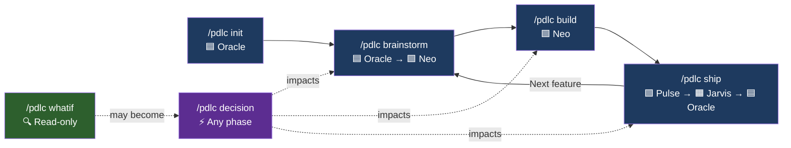
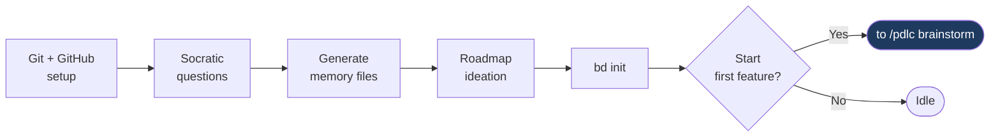
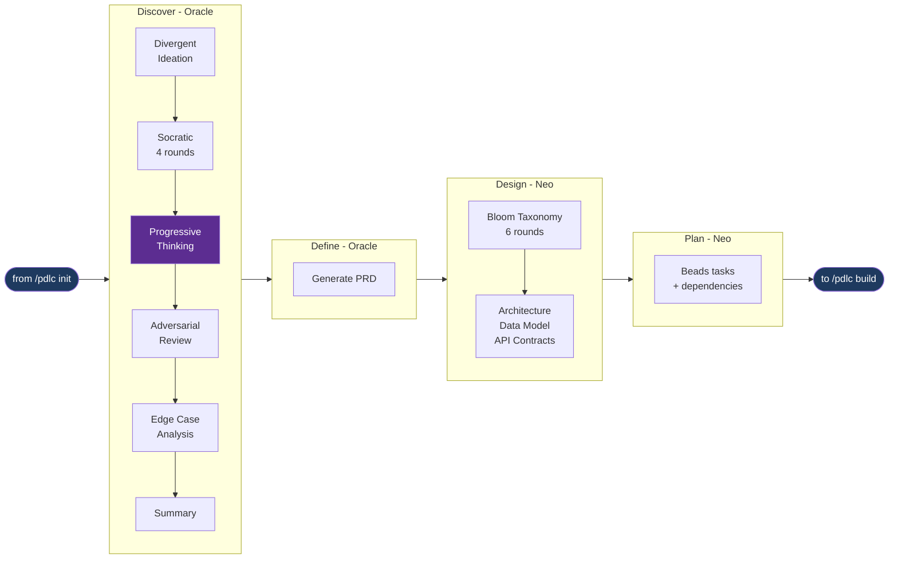
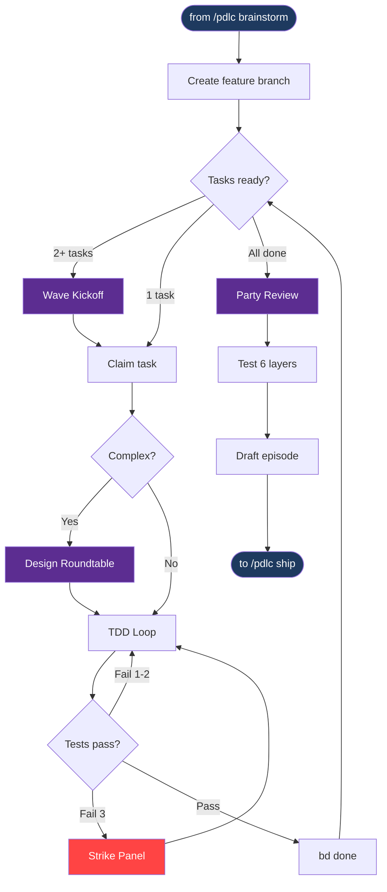
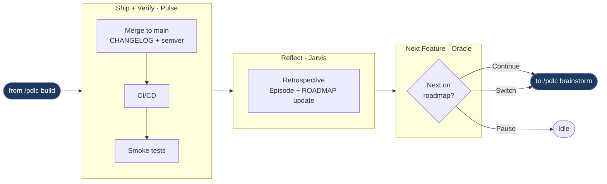

# PDLC — Product Development Lifecycle

A Claude Code plugin that guides small startup-style teams (2-5 engineers) through the full arc of feature development — from raw idea to shipped, production feature — using structured phases, a named specialist agent team, persistent memory, and safety guardrails.

PDLC combines the best of four Claude Code workflows:
- **[obra/superpowers](https://github.com/obra/superpowers)** — TDD discipline, systematic debugging, visual brainstorming companion
- **[gstack](https://github.com/garrytan/gstack)** — specialist agent roles, sprint workflow, real browser automation
- **[get-shit-done-cc](https://github.com/gsd-build/get-shit-done)** — context-rot prevention, spec-driven execution, file-based persistent memory
- **[bmad-method](https://github.com/bmadcode/bmad-method)** — adversarial review, edge case analysis, divergent ideation, multi-agent party mode

---

## Table of Contents

1. [Installation](#installation)
2. [Quick Start](#quick-start)
3. [The PDLC Flow](#the-pdlc-flow)
4. [Feature Highlights](#feature-highlights)
5. [Phases in Detail](#phases-in-detail)
6. [The Agent Team](#the-agent-team)
7. [Party Mode](#party-mode)
8. [Deadlock Detection](#deadlock-detection)
9. [Skills Architecture](#skills-architecture)
10. [Memory Bank](#memory-bank)
11. [Safety Guardrails](#safety-guardrails)
12. [Status Bar](#status-bar)
13. [Visual Companion](#visual-companion)
14. [Design Decisions](#design-decisions)
15. [pdlc-os Marketplace](#pdlc-os-marketplace)
16. [Requirements](#requirements)
17. [License](#license)

---

## Installation

PDLC can be installed **locally** (per-repo, recommended for teams) or **globally** (all projects on your machine). Both Beads (the task manager) and PDLC itself are installed with the same scope — you'll be prompted to approve Beads installation automatically.

### Local install (recommended)

Installs PDLC and Beads as devDependencies inside your repo. Hooks are written to `.claude/settings.local.json` so they only apply to this project.

```bash
cd your-repo
npm install --save-dev @pdlc-os/pdlc
```

The postinstall script auto-detects local context, registers hooks in `.claude/settings.local.json`, and prompts you to install Beads locally too.

Or install explicitly with the `--local` flag:

```bash
npx @pdlc-os/pdlc install --local
```

### Global install

Registers hooks in `~/.claude/settings.json` so PDLC is available across all projects. Beads is installed globally too.

```bash
npm install -g @pdlc-os/pdlc
```

Or without a global install:

```bash
npx @pdlc-os/pdlc install
```

Or directly from GitHub (always latest):

```bash
npm install -g pdlc-os/pdlc
```

### Verify installation

```bash
npx @pdlc-os/pdlc status
```

Shows install mode (local/global), plugin root path, hook registration, and Beads status.

### Uninstall

**Local** (from inside the repo):

```bash
npx @pdlc-os/pdlc uninstall --local
```

Removes PDLC hooks from `.claude/settings.local.json` and slash commands from `.claude/commands/`. You'll be prompted to uninstall Beads as well.

**Global:**

```bash
npx @pdlc-os/pdlc uninstall
```

Removes PDLC hooks from `~/.claude/settings.json` and slash commands from `~/.claude/commands/`. You'll be prompted to uninstall Beads globally too.

> **Note on Beads:** If your repo is already tracking tasks in Beads (`.beads/` directory), uninstalling Beads removes the CLI but your task data remains on disk. You won't be able to query or manage those tasks without the `bd` command. The uninstaller warns you about this before proceeding and defaults to keeping Beads installed.
>
> **Note on Dolt:** If you uninstall Beads, you'll also be prompted to uninstall Dolt (the SQL database Beads uses). Dolt is a system-level binary — other tools may depend on it, so the uninstaller defaults to keeping it.

### Upgrade

```bash
# Local
npx @pdlc-os/pdlc upgrade --local

# Global
npx @pdlc-os/pdlc upgrade
```

The `upgrade` command:
1. Upgrades PDLC to the latest version (matching your install scope)
2. Re-registers hooks and slash commands with updated paths
3. Prompts to upgrade Beads as well (defaults to yes)

Re-running `install` is also idempotent — it strips old hook paths and re-registers with the current version. Switching from global to local (or vice versa) automatically cleans up the previous install.

### Team onboarding (new team member pulls the repo)

When another developer clones or pulls a repo that already has PDLC initialized, they need to install PDLC locally to activate the hooks and slash commands. The project's `docs/pdlc/` memory files are already in git — they just need the tooling.

**Step 1 — Install PDLC and dependencies:**

```bash
npm install
```

If `@pdlc-os/pdlc` is in `devDependencies`, this installs it and runs the postinstall hook automatically — registering PDLC hooks in `.claude/settings.local.json` and copying slash commands to `.claude/commands/`. You'll be prompted to install Dolt and Beads if they're not already on your machine.

**Step 2 — Verify:**

```bash
npx @pdlc-os/pdlc status
```

You should see:
```
Install mode : local (this repo)
Dolt         : ✓ installed
Beads (bd)   : ✓ installed
Hooks registered: statusLine, PostToolUse, PreToolUse, SessionStart
```

**Step 3 — Start a Claude Code session:**

PDLC reads `docs/pdlc/memory/STATE.md` on session start and resumes from wherever the project left off. You'll see the current phase, active feature, and any pending work. The full memory bank (Constitution, Intent, Roadmap, Decisions, etc.) is already in the repo — no need to re-run `/pdlc init`.

> **Note:** Each developer's `.claude/settings.local.json` is local to their machine (not committed to git). The hooks point to the PDLC package in their `node_modules/`, so each developer needs their own `npm install`. The project's `docs/pdlc/` files are shared via git — this is the team's shared memory.

### Prerequisites

| Dependency | Install | Notes |
|-----------|---------|-------|
| Node.js >= 18 | [nodejs.org](https://nodejs.org) | |
| Claude Code | [claude.ai/code](https://claude.ai/code) | |
| [Dolt](https://github.com/dolthub/dolt) | Prompted during PDLC install | SQL database required by Beads; installed via Homebrew (macOS) or official script (Linux) |
| [Beads (bd)](https://github.com/gastownhall/beads) | Prompted during PDLC install | Task manager; same scope (local/global) as PDLC |
| Git | Built into macOS/Linux | |
| [GitHub CLI (gh)](https://cli.github.com) | Prompted during `/pdlc init` if needed | Required for PR creation during `/pdlc ship`; setup guided during init |

---

## Quick Start

Once installed, open any project in Claude Code:

```
/pdlc init
```

PDLC asks 7 questions about your project, scaffolds the memory bank, then **Oracle brainstorms a feature roadmap with you** — identifying, describing, and prioritizing 5–15 features in `ROADMAP.md`. Then start your first feature:

```
/pdlc brainstorm user-authentication
```

Work through Inception (discovery, PRD, design, plan), then:

```
/pdlc build
```

Build, review, and test the feature with TDD and multi-agent review. When ready:

```
/pdlc ship
```

Merge, deploy, reflect, and commit the episode record. After shipping, **Oracle reviews the roadmap and offers the next feature** — you can continue, pause, or switch to something else. The cycle repeats until the roadmap is complete.

At any point during inception or construction, record a decision or explore a scenario:

```
/pdlc decision We should use PostgreSQL instead of MongoDB
```

This triggers a **Decision Review Party** where all 9 agents assess cross-cutting impacts, produce minutes of meeting, and reconcile downstream effects (Beads tasks, PRDs, design docs, tests, roadmap sequencing) — all with your approval before any changes are applied.

```
/pdlc whatif What if we switched from REST to GraphQL?
```

This runs a **read-only What-If Analysis** — all 9 agents assess the hypothetical without changing any files. You can explore further, discard, or accept it as a formal decision.

---

## The PDLC Flow

### Summary



### Detailed flow

```mermaid
flowchart TD
    START([Session Start]) --> RESUME{STATE.md exists?}
    RESUME -->|No| INIT
    RESUME -->|Yes| AUTOLOAD[Auto-resume from\nlast checkpoint\n+ show roadmap progress]
    AUTOLOAD --> PHASE_CHECK{Current phase?}
    PHASE_CHECK -->|Inception| INCEPTION
    PHASE_CHECK -->|Construction| CONSTRUCTION
    PHASE_CHECK -->|Operation| OPERATION

    %% ── PHASE 0: INIT ──────────────────────────────────────────────
    INIT["/pdlc init"] --> GITCHECK{Git repo exists?}
    GITCHECK -->|No| GITINIT[git init + .gitignore\n+ GitHub setup]
    GITCHECK -->|Yes| GHCHECK{GitHub remote?}
    GITINIT --> GHCHECK
    GHCHECK -->|No| GHSETUP[gh CLI auth\n+ repo creation]
    GHCHECK -->|Yes| PREREQ
    GHSETUP --> PREREQ
    PREREQ[Check prereqs\nDolt + Beads] --> FIELD{Existing code?}
    FIELD -->|Brownfield| SCAN[Offer repo scan]
    SCAN -->|Accepted| SCANRUN[Deep-scan codebase\nPresent findings]
    SCANRUN --> MEM
    SCAN -->|Declined| SOC
    FIELD -->|Greenfield| SOC[7 Socratic questions]
    SOC --> MEM[Generate memory files]
    MEM --> ROADMAP[Roadmap Ideation\nOracle brainstorms features\nPrioritize + validate deps]
    ROADMAP --> BDI[bd init]
    BDI --> INITPROMPT{Start first feature?}
    INITPROMPT -->|Yes| INCEPTION
    INITPROMPT -->|No| IDLE1([Idle])

    %% ── PHASE 1: INCEPTION ─────────────────────────────────────────
    INCEPTION["/pdlc brainstorm feature-name"] --> DIVG{Divergent\nideation?}
    DIVG -->|Yes| IDEAS[100+ ideas\nDomain rotation\nCluster → Standouts]
    DIVG -->|No| SOCRATIC
    IDEAS --> SOCRATIC[DISCOVER\n4-round Socratic interview]
    SOCRATIC --> PROGRESSIVE[Progressive Thinking\n🗣 Agent team meeting\n6 rounds · Oracle facilitates]
    PROGRESSIVE --> ADVERSARIAL[Adversarial Review\n10+ findings · Top 5 follow-ups]
    ADVERSARIAL --> EDGE[Edge Case Analysis\n9 categories · path tracing]
    EDGE --> DSUM[Discovery summary]
    DSUM --> DCONF{Human confirms?}
    DCONF -->|Adjust| DSUM
    DCONF -->|Confirmed| PRD[DEFINE\nAuto-generate PRD]
    PRD --> PRDGATE{Approve PRD?}
    PRDGATE -->|Revise| PRD
    PRDGATE -->|Approved| BLOOMS[DESIGN\nBloom's Taxonomy questioning\n6 rounds · Neo leads]
    BLOOMS --> DESIGNDOCS[Generate design docs\nARCHITECTURE · data-model\napi-contracts]
    DESIGNDOCS --> DGATE{Approve design?}
    DGATE -->|Revise| DESIGNDOCS
    DGATE -->|Approved| PLAN[PLAN\nBeads tasks + dependencies]
    PLAN --> PGATE{Approve plan?}
    PGATE -->|Revise| PLAN
    PGATE -->|Approved| INCPROMPT{Start building?}
    INCPROMPT -->|Yes| CONSTRUCTION
    INCPROMPT -->|No| IDLE2([Idle])

    %% ── PHASE 2: CONSTRUCTION ──────────────────────────────────────
    CONSTRUCTION["/pdlc build"] --> BPRE[Load state\nCreate feature branch]
    BPRE --> READY{bd ready?}
    READY -->|No tasks| REVIEW
    READY -->|2+ tasks| WAVE[🗣 Wave Kickoff]
    READY -->|1 task| PICK
    WAVE --> PICK[Select task]
    PICK --> CLAIM[Claim task]
    CLAIM --> ROUNDTABLE{Complex?}
    ROUNDTABLE -->|Yes| DROUND[🗣 Design Roundtable]
    ROUNDTABLE -->|No| TDD
    DROUND --> TDD[TDD: Red → Green → Refactor]
    TDD --> TPASS{Tests pass?}
    TPASS -->|Fail 1-2| TDD
    TPASS -->|Fail 3| STRIKE[🗣 Strike Panel]
    STRIKE -->|Fix chosen| TDD
    STRIKE -->|Human takes wheel| GUIDE[Human guides] --> TDD
    TPASS -->|Pass| TASKDONE[bd done · Commit]
    TASKDONE --> READY

    REVIEW[🗣 Party Review] --> RFILE[REVIEW file]
    RFILE --> RGATE{Approve?}
    RGATE -->|Fix| REVIEW
    RGATE -->|Approve| TEST[TEST\n6 layers]
    TEST --> TGATE{Gates pass?}
    TGATE -->|Fail| TFAIL{Human decides}
    TFAIL --> TGATE
    TGATE -->|Pass| EPIDRAFT[Draft episode]
    EPIDRAFT --> BUILDPROMPT{Ship now?}
    BUILDPROMPT -->|Yes| OPERATION
    BUILDPROMPT -->|No| IDLE3([Idle])

    %% ── PHASE 3: OPERATION ─────────────────────────────────────────
    OPERATION["/pdlc ship"] --> SGATE{Confirm merge?}
    SGATE -->|Yes| MERGE[Merge to main\nCHANGELOG · semver tag]
    MERGE --> CICD[CI/CD trigger]
    CICD --> SMOKE[VERIFY\nSmoke tests + sign-off]
    SMOKE --> RETRO[REFLECT\nRetro · Episode · ROADMAP update]
    RETRO --> NEXTFEAT{Next feature?}
    NEXTFEAT -->|Continue| INCEPTION
    NEXTFEAT -->|Pause| IDLE4([Idle])
    NEXTFEAT -->|Switch| INCEPTION

    %% ── STYLE ──────────────────────────────────────────────────────
    style STRIKE fill:#ff4444,color:#fff
    style PROGRESSIVE fill:#5c2d91,color:#fff
    style WAVE fill:#5c2d91,color:#fff
    style DROUND fill:#5c2d91,color:#fff
    style REVIEW fill:#5c2d91,color:#fff
    style SGATE fill:#f0a500,color:#fff
    style PRDGATE fill:#f0a500,color:#fff
    style DGATE fill:#f0a500,color:#fff
    style PGATE fill:#f0a500,color:#fff
    style RGATE fill:#f0a500,color:#fff
    style NEXTFEAT fill:#f0a500,color:#fff
```



Legend: 🗣 = team meeting (purple) · ⚠ = approval gate (amber) · 🔴 = escalation (red)

### Approval gates

PDLC stops and waits for explicit human approval at eight checkpoints:

| Gate | When |
|------|------|
| Discovery summary | Before PRD is drafted |
| PRD | Before Design begins |
| Design docs | Before task planning begins |
| Task plan | Before Construction begins |
| Review file | Before PR comments are posted |
| Merge to main | Before merging feature branch |
| Smoke tests | Before marking deployment complete |
| Episode file | Before committing to repo |

---

## Feature Highlights

### Inception — Deep Discovery

| Feature | What it does |
|---------|-------------|
| **Divergent Ideation** | Optional pre-discovery: 100+ raw ideas using structured domain rotation (Technical -> UX -> Business -> Edge Cases), cycling every 10 ideas to prevent semantic drift. Clusters into themes, surfaces 10-15 standouts. |
| **4-Round Socratic Interview** | Active + Challenging questioning posture across Problem Statement, Future State, Acceptance Criteria, and Current State. Minimum 5 questions per round. |
| **Progressive Thinking** | Required agent team meeting after Socratic discovery. Oracle facilitates 6 rounds with all agents: Concrete (facts) → Inferential (inferences) → Consequential (implications) → Speculative (unknowns) → Conflicting (disagreements) → Strategic (priorities). User escalation only when agents can't resolve. |
| **Adversarial Review** | Devil's advocate analysis across 10 dimensions (assumption gaps, scope leaks, metric fragility, technical blindspots, etc.). Minimum 10 findings. Top 5 become targeted follow-ups. |
| **Edge Case Analysis** | Mechanical path tracing across 9 categories (user flow branches, boundary data, concurrency, integration failures, etc.). User triages each finding: in-scope, out-of-scope, or known risk. |
| **Bloom's Taxonomy Design Questioning** | Neo leads 6 rounds during Design: Remember (facts) → Understand (mechanics) → Apply (stack-specific) → Analyze (trade-offs) → Evaluate (judgments) → Create (synthesis). Produces design discovery log before document generation. |
| **Brainstorm Log** | Progressive content record at `docs/pdlc/brainstorm/`. Captures all ideation and design discovery context for mid-session resume and document generation. Separate from STATE.md. |
| **Visual Companion** | Optional browser-based UI for mockups, wireframes, and architecture diagrams during Inception. Consent-based, per-question. |

### Initialization — Foundation

| Feature | What it does |
|---------|-------------|
| **Git & GitHub Setup** | Auto-detects missing git repo, offers to initialize with `.gitignore`. Verifies GitHub connectivity, walks through `gh` CLI auth and repo creation if needed. |
| **Roadmap Ideation** | Oracle brainstorms 5–15 features with you, assigns permanent `F-NNN` IDs, and collaboratively prioritizes by dependencies, user value, and technical risk. |
| **Brownfield Repo Scan** | Deep-scans existing codebases to pre-populate memory files from real code. All inferred content is marked for verification. |

### Construction — TDD + Multi-Agent Build

| Feature | What it does |
|---------|-------------|
| **TDD Enforcement** | No implementation code without a failing test first. Red -> Green -> Refactor per acceptance criterion. |
| **Party Mode** | 5 multi-agent meeting types: Wave Kickoff, Design Roundtable, Party Review, Strike Panel, Decision Review. 3 spawn modes (agent-teams, subagents, solo). |
| **Meeting Announcements** | Before every party meeting: who called it, participants, purpose, and estimated duration. Progress updates if it runs long. |
| **3-Strike Loop Breaker** | After 3 failed auto-fix attempts, convenes a Strike Panel (Neo + Echo + domain agent) to diagnose root cause and produce 3 ranked approaches for the human. |
| **Deadlock Detection** | 6 types of deadlock detection with auto-resolution and human escalation paths. |
| **Critical Finding Gate** | Critical review findings must be fixed or explicitly overridden (Tier 1 event) before approval options appear. |
| **6-Layer Testing** | Unit, Integration, E2E (real Chromium), Performance, Accessibility, Visual Regression. Constitution configures which are required gates. |

### Operation — Ship + Reflect + Next Feature

| Feature | What it does |
|---------|-------------|
| **Merge Commit Strategy** | `git merge --no-ff` preserves full branch history. Semantic versioning with auto-tagging. |
| **CHANGELOG Generation** | Jarvis drafts Conventional Changelog entries from commit history during Ship. |
| **Smoke Test Verification** | Runs against deployed environment with human sign-off gate. |
| **Retrospective** | Per-agent contributions, what went well / broke / to improve, metrics snapshot. Episode file committed to permanent record. |
| **Roadmap Tracking** | Jarvis marks shipped features in ROADMAP.md with date and episode reference. Ad-hoc features retroactively added. |
| **Feature Loop** | After shipping, Oracle presents the next roadmap feature. Continue, pause, or switch to a different feature — the cycle repeats automatically. |

### Decision Registry (`/pdlc decision`)

| Feature | What it does |
|---------|-------------|
| **Any-Phase Decisions** | Record decisions at any point during Inception or Construction. The current phase lead runs the flow. |
| **Decision Review Party** | All 9 agents assess impacts on their owned artifacts — code, tests, architecture, PRD, roadmap, UX flows, environment config, documentation. |
| **Cross-Cutting Impact** | Identifies chain reactions (e.g., backend change → frontend update → test modification → roadmap resequencing). |
| **MOM with Recommendations** | Minutes of meeting with per-agent assessments, risk consensus, recommended changes table, and roadmap resequencing proposal. |
| **Phase-Aware Reconciliation** | Updates Beads tasks, PRDs, design docs, episode drafts, test flags, and announces decision context to the team on resume. |
| **Durable Checkpoints** | Decision and meeting progress saved to disk. Survives network failures, usage limits, and accidental exits. Session-start hook detects interrupted work and offers recovery. |

### What-If Analysis (`/pdlc whatif`)

| Feature | What it does |
|---------|-------------|
| **Read-Only Exploration** | Explore "what if" scenarios without modifying any project files. Only a MOM is created. |
| **Full Team Analysis** | All 9 agents assess the hypothetical scenario: architecture, code, tests, security, UX, docs, ops, roadmap, product impact. |
| **Iterative Deepening** | Explore further by drilling into specific aspects — each round produces a versioned MOM. |
| **Convert to Decision** | Accept the analysis as a formal decision — reuses the existing MOM (no duplicate meetings), then runs the decision workflow for reconciliation. |
| **Safe to Discard** | File the analysis for reference and resume where you left off. MOM files are kept permanently. |

### Cross-Cutting

| Feature | What it does |
|---------|-------------|
| **Safety Guardrails** | 3-tier system: Tier 1 hard blocks, Tier 2 pause-and-confirm, Tier 3 logged warnings. Configurable via Constitution. |
| **Colored Transitions** | Phase transitions (cyan), sub-phase transitions (yellow), and agent handoffs (magenta) with ANSI color codes. |
| **Humanized Handoffs** | Agent transitions include warm farewells and enthusiastic welcomes — feels like a real team. |
| **Material Design Visual Companion** | Browser-based UI with MD2 styling, Roboto font, elevation system, light/dark toggle. Click-to-select with dual input (browser + terminal). |
| **Auto-Resume** | Every session reads STATE.md and resumes from the exact last checkpoint. No work is lost. |
| **Durable Party Checkpoints** | All party meetings write progress to `.pending-party.json`. Interrupted meetings are detected on next session start and can be resumed. |
| **MOM Files** | Meeting minutes for all party sessions, capturing who said what, conclusions, and next steps. |
| **Episode Memory** | Permanent delivery records indexed in `episodes/index.md`. Searchable history of every feature shipped. |

---

## Phases in Detail

### Phase 0 -- Initialization (`/pdlc init`)



Run once per project. **Oracle** leads. PDLC checks prerequisites, then detects whether you're starting fresh or bringing in an existing codebase.

**Git & GitHub setup**: If no git repo exists, PDLC offers to initialize one with a `.gitignore` (node_modules, .claude, .env, etc.). Then verifies GitHub connectivity — if no remote is configured, walks you through creating a repo (GitHub.com or GitHub Enterprise) and authenticating with the `gh` CLI. This ensures `/pdlc ship` can create PRs without issues later.

**Greenfield** (empty repo): PDLC asks 7 Socratic questions and scaffolds memory files from your answers.

**Brownfield** (existing code): PDLC offers to deep-scan the repository, mapping structure, reading key files, analyzing tests and git history. Scan findings are presented for approval, then used to pre-populate memory files. All inferred content is marked `(inferred -- please verify)`.

**Roadmap Ideation**: Oracle brainstorms 5-15 candidate features, validates priority sequence for dependency conflicts, and captures the backlog in `ROADMAP.md` with permanent `F-NNN` IDs. Auto-launches the first priority feature on confirmation.

**PDLC scaffolds:** CONSTITUTION, INTENT, STATE, ROADMAP, DECISIONS, CHANGELOG, OVERVIEW, episodes/index, and `.beads/`.

### Phase 1 -- Inception (`/pdlc brainstorm <feature>`)



Oracle leads Discover + Define, then hands off to Neo for Design + Plan. The feature's ROADMAP.md status is set to `In Progress` when brainstorm begins.

| Sub-phase | Lead | Key activities | Output |
|-----------|------|---------------|--------|
| **Discover** | Oracle | Divergent ideation (optional), Socratic interview (4 rounds), **Progressive Thinking** (required agent meeting), Adversarial review, Edge case analysis | Confirmed discovery summary |
| **Define** | Oracle | Auto-generate PRD from brainstorm log | `PRD_[feature]_[date].md` |
| **Design** | Neo | Bloom's Taxonomy questioning (6 rounds), Architecture + data model + API contracts | `docs/pdlc/design/[feature]/` |
| **Plan** | Neo | Beads tasks with dependencies, dependency graph | Plan file |

### Phase 2 -- Construction (`/pdlc build`)



**Neo** leads the entire phase.

| Sub-phase | Meetings | What happens |
|-----------|----------|-------------|
| **Build** | Wave Kickoff, Design Roundtable, Strike Panel | TDD per task. Wave standup for 2+ tasks. Optional roundtable for complex tasks. 3-strike cap. |
| **Review** | Party Review | Neo, Echo, Phantom, Jarvis in parallel with cross-talk. Critical findings gate. Deferred findings via Decision Review. |
| **Test** | -- | 6 layers. Constitution gates determine required. Human decides on failures. |

### Phase 3 -- Operation (`/pdlc ship`)



| Sub-phase | Lead | What happens |
|-----------|------|-------------|
| **Ship** | Pulse | Merge commit to main, CHANGELOG entry, semantic version tag, CI/CD trigger |
| **Verify** | Pulse | Smoke tests against deployed environment + human sign-off |
| **Reflect** | Jarvis | Per-agent retro, metrics, episode finalization, ROADMAP.md marked `Shipped` |
| **Next Feature** | Oracle | Reviews roadmap, presents next priority. **Continue**, **pause**, or **switch** |

### Pivoting with `/pdlc decision <text>`

Use `/pdlc decision` to **pivot** the design mid-flight -- change tech stack, rearchitect a component, alter scope, switch databases, or any other significant change. Available at any point during Inception, Construction, or Operation. The lead agent for the current phase runs the flow:

| Step | What happens |
|------|-------------|
| **Checkpoint** | Pauses current workflow, saves recovery state |
| **Classify** | Tag source (user vs PDLC flow), phase, sub-phase, agent |
| **Decision Review Party** | All 9 agents assess impacts on their owned artifacts |
| **MOM** | Minutes with assessments, cross-cutting concerns, risk consensus, roadmap resequencing proposal |
| **User approval** | Recommended changes table. Apply all, selectively, modify, or cancel |
| **Reconciliation** | Beads tasks, PRDs, design docs, episode drafts, test flags, roadmap all updated |
| **Resume** | Returns to the paused checkpoint with updated context |

Feature IDs (`F-NNN`) are permanent. Priority is a separate column -- resequencing never renumbers IDs or ADRs.

### Scenario planning with `/pdlc whatif <scenario>`

Use `/pdlc whatif` for **scenario planning** -- explore hypothetical changes without committing. The full team analyzes feasibility, effort, risks, and trade-offs in a read-only meeting. No files are modified.

| Outcome | What happens |
|---------|-------------|
| **Explore further** | Drill deeper into a specific aspect -- versioned MOM |
| **Accept as decision** | Converts to formal decision, reuses the What-If MOM (no duplicate meeting), runs decision workflow for reconciliation |
| **Discard** | Files the MOM for reference, resumes paused workflow |

Together, `/pdlc decision` and `/pdlc whatif` give you a full **pivot and scenario planning toolkit**: explore ideas safely with whatif, then commit to them with decision when ready.

---

## The Agent Team

PDLC assigns named specialist agents to each area of concern. Each has a distinct focus and personality that shapes their contributions.

### Always-on (every task, every review)

| Name | Role | Model | Focus | Style |
|------|------|-------|-------|-------|
| **Neo** | Architect | Opus | High-level design, cross-cutting concerns, tech debt radar | Decisive, big-picture, challenges scope creep |
| **Echo** | QA Engineer | Sonnet | Test strategy, edge cases, regression coverage | Methodical, pessimistic about happy-path assumptions |
| **Phantom** | Security Reviewer | Sonnet | Auth, input validation, OWASP Top 10, secrets | Paranoid, precise, never lets "we'll fix it later" slide |
| **Jarvis** | Tech Writer | Sonnet | Docs, API contracts, CHANGELOG, README | Clear, audience-aware, flags ambiguous naming |

### Auto-selected (based on task labels)

| Name | Role | Model | Focus | Style |
|------|------|-------|-------|-------|
| **Bolt** | Backend Engineer | Opus | APIs, services, DB, business logic | Pragmatic, performance-aware, opinionated about data models |
| **Friday** | Frontend Engineer | Opus | UI components, state, UX implementation | Detail-oriented, accessibility-conscious |
| **Muse** | UX Designer | Sonnet | User flows, interaction design, mental models | Empathetic, non-technical framing, pushes back on dev-centric thinking |
| **Oracle** | PM | Opus | Requirements clarity, scope, acceptance criteria | Scope guardian, pushes for testable definitions |
| **Pulse** | DevOps | Opus | CI/CD, infra, deployment, environment config | Ops-first, questions anything that doesn't deploy cleanly |

> **Model strategy:** Opus (5 agents) handles complex reasoning — architecture, product decisions, backend/frontend engineering, deployment. Sonnet (4 agents) handles focused specialized work — testing, security review, documentation, UX design.

---

### Lead agents by phase

| Phase / Sub-phase | Lead Agent | Also leads `/pdlc decision` |
|-------------------|-----------|----------------------------|
| Init | Oracle | Yes |
| Brainstorm — Discover + Define | Oracle | Yes |
| Brainstorm — Design + Plan | Neo | Yes |
| Build (all sub-phases) | Neo | Yes |
| Ship — Ship + Verify | Pulse | Yes |
| Ship — Reflect | Jarvis | Yes |
| Ship — Next Feature | Oracle | Yes |
| Idle / between phases | — | Oracle |

---

## Party Mode

Party mode brings multiple agents together for structured discussions. Five meeting types fire at specific points in the workflow.

### Meeting types

| Meeting | Phase | Trigger | Participants | Output |
|---------|-------|---------|-------------|--------|
| **Progressive Thinking** | Inception / Discover | After Socratic discovery completes (required, cannot skip) | Oracle (facilitates) + all 8 other agents | Refined feature understanding: confirmed facts, inferences, consequences, risks, priorities |
| **Wave Kickoff** | Construction / Build | Start of a new Beads wave (2+ tasks) | Neo + domain agents + Echo (if 3+ tasks) | Wave execution plan, dependency updates |
| **Design Roundtable** | Construction / Build | Complex task claimed (auto-suggested) | Neo + Echo + domain agent | Implementation Decision for TDD |
| **Party Review** | Construction / Review | All tasks complete | Neo + Echo + Phantom + Jarvis | Unified review file with linked findings |
| **Strike Panel** | Construction / Build | 3rd failed auto-fix attempt | Neo + Echo + domain agent | 3 ranked approaches for human |
| **Decision Review** | Any phase | `/pdlc decision` or deferred findings | All 9 agents | MOM with impact assessment, roadmap resequencing, recommended changes |
| **What-If Analysis** | Any phase | `/pdlc whatif` | All 9 agents | Read-only MOM with feasibility, effort, risks, trade-offs, recommendation |

### Meeting map across phases

```
Init ──────────────── (no meetings — Oracle works solo with user)

Brainstorm
  Discover ─────────── Progressive Thinking (required, agents-only)
  Define ───────────── (no meetings — Oracle generates PRD)
  Design ───────────── (no meetings — Neo questions user via Bloom's Taxonomy, then generates docs)
  Plan ─────────────── (no meetings — Neo generates tasks)

Build
  Build Loop ───────── Wave Kickoff → [Design Roundtable] → Build → [Strike Panel] → ...
  Review ───────────── Party Review
  Test ─────────────── (no meetings)

Ship
  Ship ─────────────── (no meetings — Pulse handles merge/deploy)
  Verify ───────────── (no meetings — Pulse runs smoke tests)
  Reflect ──────────── (no meetings — Jarvis writes retro)

Any phase ──────────── Decision Review (/pdlc decision)
Any phase ──────────── What-If Analysis (/pdlc whatif)
```

### Spawn modes

Set once at the first Wave Kickoff, applies for the session:

| Mode | How it works | Best for |
|------|-------------|----------|
| **Agent Teams** | Main Claude embodies Neo; others are real subagents spawned in parallel | Complex tasks with multiple concerns |
| **Subagents** | All agents including Neo spawned independently; main Claude is pure orchestrator | Zero-bias multi-perspective review |
| **Solo** | Single LLM roleplays all agents in one response | Fast iteration, fallback when spawning fails |

All meetings produce MOM (minutes of meeting) files at `docs/pdlc/mom/`.

### Meeting announcements

Before every meeting, PDLC tells you what's happening: which agents are participating, what they're discussing, and roughly how long it will take (~30s for a standup, ~2–4 min for a full Decision Review). If the meeting runs long, you'll see a progress update about what the team is debating.

### Durable checkpoints

Every party meeting writes a `.pending-party.json` checkpoint file before spawning agents. Progress is tracked at milestones (`started` → `round-1-complete` → `cross-talk-complete` → `mom-written` → `presented`). If a session is interrupted (network, usage limits, accidental exit), the next session detects the pending meeting and offers to resume from the last milestone or restart. The checkpoint file is deleted when the meeting completes normally.

---

## Deadlock Detection

When multiple agents or tasks work in parallel, they can get stuck. PDLC detects 6 types of deadlock and resolves them automatically or escalates to the human.

| Type | Detection | Auto-resolve | Escalate to human |
|------|-----------|-------------|-------------------|
| **Beads Circular Dependency** | `bd ready` empty but open tasks remain | Remove most-recently-added dep | Multiple overlapping cycles |
| **Agent Spawn Failure** | Agent returns empty/error | Continue without failed agent; solo fallback | All agents fail |
| **Consensus Failure** | Agents contradict after cross-talk | N/A | Always (Design Roundtable); surface both (Party Review) |
| **Fix-Regenerate Loop** | 3 fix cycles without resolving Critical findings | N/A | Human chooses: continue, override, or abandon |
| **Strike Panel Cycling** | Same test fails through 2+ panels | Pass history to prevent re-proposals | 3rd panel: redesign, skip, or human control |
| **BUILD LOOP Stagnation** | Same task list returned repeatedly | Reconcile `bd done` state | Loop count exceeds total tasks |

---

## Skills Architecture

PDLC is built entirely from skills — markdown files that Claude reads and executes. Large skills are split into sub-files for context window efficiency.

### Phase skills (user-invocable)

| Skill | Command | What it does |
|-------|---------|-------------|
| **Init** | `/pdlc init` | Initialize PDLC for this project (run once) |
| **Brainstorm** | `/pdlc brainstorm <feature>` | Run Inception: Discover -> Define -> Design -> Plan |
| **Build** | `/pdlc build` | Run Construction: Build (TDD) -> Review -> Test |
| **Ship** | `/pdlc ship` | Run Operation: Ship -> Verify -> Reflect -> Next Feature |
| **Decision** | `/pdlc decision <text>` | Record a decision with full team impact assessment (any phase) |
| **What-If** | `/pdlc whatif <scenario>` | Read-only team analysis of a hypothetical scenario (any phase) |

### Supporting skills (referenced internally)

| Skill | What it governs |
|-------|-----------------|
| **TDD** | Red -> Green -> Refactor cycle; test-first enforcement; 3-attempt auto-fix cap |
| **Review** | Multi-agent review protocol; reviewer responsibilities; finding severity levels |
| **Test** | Six test layer execution order; Constitution gate checking |
| **Reflect** | Retro format; per-agent contributions; shipping streaks; metrics |
| **Decision** | Decision Review Party; 9-agent impact assessment; MOM generation; phase-aware reconciliation |
| **What-If** | Read-only scenario exploration; team analysis meeting; option to convert to formal decision |
| **Safety Guardrails** | Tier 1/2/3 definitions; double-RED override protocol |
| **Repo Scan** | Brownfield deep-scan; pre-populates memory files from existing codebase |
| **Visual Companion** | Browser-based mockup and diagram loop during Inception |
| **Writing Clearly** | Strunk's *Elements of Style* rules applied to all prose for human review |

### File structure

```
skills/
  init/
    SKILL.md                          <- orchestrator
    steps/
      01-setup.md                     <- brownfield detection + directories
      02-socratic-init.md             <- 7 Socratic questions
      03-generate-memory.md           <- create all memory files
      04-roadmap.md                   <- feature ideation + prioritization
      05-finalize.md                  <- Beads init + summary

  brainstorm/
    SKILL.md                          <- orchestrator
    visual-companion.md               <- browser server protocol
    steps/
      00-divergent-ideation.md        <- optional: 100+ ideas
      01-discover.md                  <- orchestrator for discovery
        discover/
          01-socratic-discovery.md    <- 4-round interview
          02-adversarial-review.md    <- 10+ findings, top 5 follow-ups
          03-edge-case-analysis.md    <- 9-category path tracing
          04-synthesis.md             <- external context + summary
          05-blooms-taxonomy-design.md <- 6-round design questioning (Neo)
          06-progressive-thinking.md  <- agent team meeting (Oracle facilitates)
      02-define.md                    <- PRD generation + approval
      03-design.md                    <- architecture, data model, API contracts
      04-plan.md                      <- Beads tasks + dependencies

  build/
    SKILL.md                          <- orchestrator
    steps/
      01-pre-flight.md                <- load state, create branch
      02-build-loop.md                <- Steps 4-11: the core TDD loop
      03-review.md                    <- party review + approval gate
      04-test.md                      <- 6 test layers + constitution gates
      05-wrap-up.md                   <- episode draft + completion
    party/
      orchestrator.md                 <- shared spawn protocol + MOM format
      01-wave-kickoff.md              <- standup for multi-task waves
      02-design-roundtable.md         <- optional pre-build design debate
      03-party-review.md              <- parallel review with cross-talk
      04-strike-panel.md              <- 3rd-failure root cause diagnosis
      deadlock-protocol.md            <- 6 deadlock types + resolution

  ship/
    SKILL.md                          <- orchestrator
    steps/
      01-ship.md                      <- merge, changelog, semver, CI/CD
      02-verify.md                    <- smoke tests + sign-off
      03-reflect.md                   <- retro + episode + roadmap + next feature

  decision/
    SKILL.md                          <- decision review party + reconciliation

  whatif/
    SKILL.md                          <- read-only scenario analysis
```

---

## Memory Bank

All PDLC-generated files live under `docs/pdlc/` inside your repo, version-controlled alongside your code:

```
docs/pdlc/
  memory/
    CONSTITUTION.md        <- rules, standards, test gates, guardrail overrides
    INTENT.md              <- problem statement, target user, value proposition
    STATE.md               <- current phase, active task, party mode, phase history
    ROADMAP.md             <- prioritized feature backlog (F-NNN IDs, separate priority column)
    DECISIONS.md           <- decision registry (ADR format, links to MOM files)
    CHANGELOG.md           <- what shipped and when
    OVERVIEW.md            <- aggregated delivery state
    episodes/
      index.md             <- searchable episode index
      001_auth_2026-04-04.md
  prds/
    PRD_[feature]_[date].md
    plans/
      plan_[feature]_[date].md
  design/
    [feature]/
      ARCHITECTURE.md
      data-model.md
      api-contracts.md
  reviews/
    REVIEW_[feature]_[date].md
  brainstorm/
    brainstorm_[feature]_[date].md
  mom/
    [feature]_[topic]_mom_[YYYY]_[MM]_[DD].md
    MOM_decision_[ADR-NNN]_[YYYY-MM-DD].md
```

### Episodic memory

Every time a feature is delivered, Claude drafts an episode file capturing what was built, key decisions, test results, tech debt, and the agent team's retro. Human approves before it's committed to permanent record.

---

## Safety Guardrails

PDLC enforces a three-tier safety system. Rules can be adjusted in `CONSTITUTION.md`.

### Tier 1 — Hard block

Blocked by default. Requires **double confirmation in red text** to override.

- Force-push to `main` or `master`
- `DROP TABLE` without a prior migration file
- `rm -rf` outside files created on the current feature branch
- Deploy with failing Constitution test gates

### Tier 2 — Pause and confirm

PDLC stops and asks before proceeding. Individual items can be downgraded to Tier 3 in `CONSTITUTION.md`.

- Any `rm -rf` or bulk delete
- `git reset --hard`
- Production database commands
- Any external API write call (POST/PUT/DELETE to external URLs)
- Modifying `CONSTITUTION.md`
- Closing all open Beads tasks at once

### Tier 3 — Logged warning

PDLC proceeds and records the decision in `STATE.md`.

- Skipping a test layer
- Overriding a Constitution rule
- Accepting a Phantom security warning without fixing
- Accepting an Echo test coverage gap

---

## Status Bar

After installation, PDLC adds a live status bar to every Claude Code session:

```
Construction | bd-a1b2: Add auth middleware | my-app | ██████░░░░ 58%
```

| Element | Source |
|---------|--------|
| Phase | `docs/pdlc/memory/STATE.md` |
| Active task | Current Beads task (ID + title) |
| Context bar | Green < 50%, yellow 50-65%, orange 65-80%, red >= 80% |

A background hook fires after every tool call and injects context warnings at >= 65%, automatically saving your position to `STATE.md` so no work is lost if the context window compacts.

---

## Visual Companion

During Inception (`/pdlc brainstorm`), PDLC can optionally run a local Node.js + WebSocket server and give you a `localhost` URL to open in your browser.

**Consent-based:** Claude asks in a standalone message whether you want visual support. You can decline and work entirely in the terminal.

**Per-question, not per-session:** Even after accepting, Claude decides each question: browser for visual content (mockups, layout comparisons, Mermaid diagrams), terminal for text (requirements, tradeoffs, scope decisions).

**What appears in the browser:**
- UI wireframes and layout comparisons (click to select your preference)
- Mermaid architecture diagrams and data flow charts
- Side-by-side design options with pros/cons
- The Beads task dependency graph at the end of Plan

The server shuts down automatically when Inception ends. Mockup files persist in `.pdlc/brainstorm/` for reference.

---

## Design Decisions

The architecture of PDLC reflects deliberate choices about how small teams should build software with AI assistance. Each decision below was made for a specific reason.

### File-based memory instead of a database

All state lives as human-readable markdown in the repo, version-controlled via git. No external service dependency. You can understand project state by reading files, not querying APIs. Git log becomes the audit trail. Everything survives Claude Code restarts and context window resets.

### Beads as external peer dependency, not bundled

Task management is a distinct domain. Beads handles complex dependency resolution, wave-based scheduling, and persistent task state — capabilities expensive to re-implement. Keeping it external means both tools evolve independently, and teams can use Beads outside PDLC. PDLC orchestrates phases; Beads manages task flow.

### TDD enforced by default

Small startup teams cannot afford untested features. The cost of a production bug outweighs upfront test investment. No implementation code is written without a failing test first. Test names use exact Given/When/Then language from PRD user stories, enforcing specificity. The 3-attempt auto-fix cap prevents infinite debugging cycles and forces a conversation about whether the design itself is wrong.

### Three spawn modes for party meetings

Each mode trades off independence, speed, and fidelity:

- **Agent Teams**: highest fidelity (each agent independently reasoned), medium speed. Best when architectural decisions matter.
- **Subagents**: highest fidelity with zero orchestrator bias, slowest. Best for unbiased multi-perspective review.
- **Solo**: medium fidelity (single LLM maintaining personas risks false consensus), fastest. Emergency fallback or when spawning fails.

Users pick once per session. The choice is stored in STATE.md and never asked again.

### Adversarial review requires 10+ findings

Requiring a minimum forces the reviewer past surface-level concerns into root causes — assumptions, scope leaks, dependency blindspots. If 10 issues aren't found, the feature concept is probably solid. If they're found easily, there are serious blindspots to address before building.

### Edge case analysis is method-driven, orthogonal to adversarial review

Adversarial review asks "what's wrong with this idea?" (attitude-driven, critical). Edge case analysis asks "what paths are unhandled?" (method-driven, mechanical). Adversarial catches design flaws and assumption conflicts. Edge cases catch unhandled user flows, boundary conditions, and error paths. Running both ensures complementary coverage — neither subsumes the other.

### Brainstorm log is separate from STATE.md

Different retention and scope. The brainstorm log (`docs/pdlc/brainstorm/`) is a content record for a single feature's discovery: ideas, Q&A, adversarial findings, edge case triage. STATE.md is a project-wide operational state: current phase, active task, party mode, append-only phase history. Keeping them separate lets brainstorm logs be archived without losing project state, and keeps STATE.md lean.

### Approval gates are human-only

Every gate pauses for explicit human confirmation. "Looks good" counts as approval; silence does not. This prevents silent feature drift, catches misalignment early (rejecting a PRD is cheaper than discovering the problem on day 3 of construction), and establishes clear decision ownership. PDLC surfaces options; humans own the final call.

### 3-strike cap before Strike Panel

Attempts 1-3 are normal TDD iteration. If a test still fails after 3 different fixes, the problem is likely the design, not the code. The cap forces a structured conversation: the Strike Panel (Neo + Echo + domain agent) diagnoses root cause and produces ranked approaches. This prevents infinite auto-fix loops while providing expert diagnosis instead of just "try again."

### Deadlock protocol for multi-agent coordination

When 2+ agents or tasks work in parallel, they can deadlock in ways a single developer never would: circular task dependencies, agent spawn failures, consensus failures, stagnating build loops. Each of the 6 deadlock types has a detection condition, auto-resolution path (for unambiguous cases), and human escalation path (for ambiguous or irreversible decisions). Without this protocol, a stuck agent team would spin forever.

### MOM files for meeting minutes

Meeting minutes (`docs/pdlc/mom/`) capture what agents said and decided — the reasoning behind decisions, not just the decisions themselves. Episode files capture what was delivered. Keeping them separate means MOMs can be cleaned up after shipping while episodes remain as permanent records. MOMs feed into episodes, but episodes synthesize beyond any single meeting.

### Constitution as single source of truth

One file to override all defaults. `CONSTITUTION.md` governs tech stack, architectural constraints, test gates, guardrail overrides, and coding standards. Everything else in PDLC is a default. Different teams have different risk profiles, and different projects have different constraints. Rather than forking PDLC per project, edit Constitution.

### Skills split into sub-files

Large skill files (400+ lines) are broken into sub-files in `steps/` subdirectories. Each sub-file is self-contained, reads cleanly in isolation, and ends with an explicit "Return to SKILL.md" instruction. The main SKILL.md becomes a lightweight orchestrator. This keeps each file within context limits, makes individual steps easier to update, and reduces context usage per step — leaving more room for implementation code.

### Merge commits instead of squash

`git merge --no-ff` preserves full branch history. If a bug appears later, `git bisect` can trace it through the feature branch. The development narrative stays intact for future team members. Every merge commit is tagged with version and feature name, making `git log --merges` a readable timeline of shipped features.

### Soft warnings for review findings

Phantom (security), Echo (QA), and Neo (architecture) findings are soft warnings by default — human decides: fix, accept, or defer. Exception: Critical findings are hard blocks until fixed or explicitly overridden (Tier 1 event). Why soft? "Perfect code" doesn't exist. A security warning might be acceptable for v1; a coverage gap might be acceptable for well-understood logic. Soft warnings prevent review fatigue while keeping the human in control. All accepted warnings are logged as Tier 3 events.

### STATE.md phase history is append-only

Nothing is deleted, only appended. You can ask "when did we start building feature X?" without re-running git log. If a deadlock happens, the event sequence is visible. Cycle time and throughput metrics can be calculated directly from the log. The state file itself becomes the audit trail.

### Design pivots via `/pdlc decision`

Software projects change direction. A mid-build decision to switch databases, rearchitect a service, or change scope needs to propagate cleanly: update the architecture docs, rewrite affected Beads tasks, flag tests that need changing, resequence the roadmap. Without a structured pivot mechanism, these changes fragment across conversations and files, creating drift between what was designed and what exists. The Decision Review Party ensures every agent assesses the blast radius before anything changes, and the phase-aware reconciliation updates all downstream artifacts in one pass.

### Scenario planning via `/pdlc whatif`

Before committing to a change, you want to know the cost. "What if we switched to GraphQL?" is a question with implications for architecture, frontend, tests, docs, deployment, and timeline -- but asking it shouldn't force you to commit. What-If analysis lets the full team assess a hypothetical in a read-only meeting, producing a MOM with feasibility, effort, risks, and trade-offs. If the analysis is promising, convert it to a decision (reusing the existing MOM -- no duplicate meeting). If not, discard it and resume where you were. This separates exploration from commitment.

---

## pdlc-os Marketplace

| Resource | URL |
|----------|-----|
| GitHub org | https://github.com/pdlc-os |
| Core package | https://www.npmjs.com/package/@pdlc-os/pdlc |
| Registry index | https://github.com/pdlc-os/registry |
| Contribution guide | https://github.com/pdlc-os/registry/blob/main/CONTRIBUTING.md |

The `pdlc-os` GitHub organisation hosts community-contributed extensions:

| Type | Examples |
|------|---------|
| **Workflow templates** | `@pdlc-os/workflow-saas-mvp`, `@pdlc-os/workflow-api-service` |
| **Role packs** | `@pdlc-os/agent-fintech-security`, `@pdlc-os/agent-accessibility-auditor` |
| **Stack adapters** | `@pdlc-os/stack-nextjs-supabase`, `@pdlc-os/stack-rails-postgres` |
| **Integration plugins** | `@pdlc-os/integration-linear`, `@pdlc-os/integration-notion` |
| **Skill packs** | `@pdlc-os/skill-hipaa`, `@pdlc-os/skill-seo-audit` |

---

## Requirements

| Requirement | Version |
|-------------|---------|
| Node.js | >= 18 |
| Claude Code | Latest |
| [Beads (bd)](https://github.com/gastownhall/beads) | Latest |
| Git | Any recent version |

---

## License

MIT (c) pdlc-os contributors
