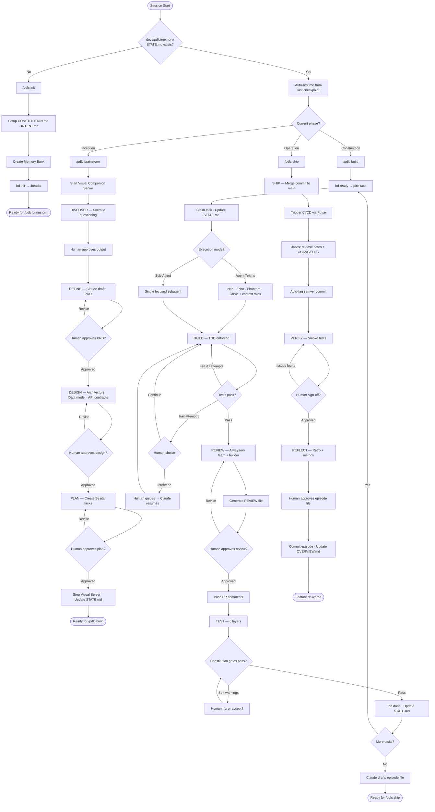

# PDLC — Product Development Lifecycle

A Claude Code plugin that guides small startup teams (2–5 engineers) through the full arc of feature development — from raw idea to shipped, production feature — using structured phases, a named specialist agent team, persistent memory, and safety guardrails.

PDLC combines the best of three Claude Code workflows:
- **[obra/superpowers](https://github.com/obra/superpowers)** — TDD discipline, systematic debugging, visual brainstorming companion
- **[gstack](https://github.com/garrytan/gstack)** — specialist agent roles, sprint workflow, real browser automation
- **[get-shit-done-cc](https://github.com/gsd-build/get-shit-done)** — context-rot prevention, spec-driven execution, file-based persistent memory

---

## Table of Contents

1. [Installation](#installation)
2. [Quick Start](#quick-start)
3. [The PDLC Flow](#the-pdlc-flow)
4. [Phases in Detail](#phases-in-detail)
5. [The Team](#the-team)
6. [Skills](#skills)
7. [Memory Bank](#memory-bank)
8. [Safety Guardrails](#safety-guardrails)
9. [Status Bar](#status-bar)
10. [Visual Companion](#visual-companion)
11. [pdlc-os Marketplace](#pdlc-os-marketplace)
12. [Requirements](#requirements)
13. [License](#license)

---

## Installation

### Option A — npx (no global install)

```bash
npx @pdlc-os/pdlc install
```

### Option B — global install

```bash
npm install -g @pdlc-os/pdlc
pdlc install
```

Both commands register PDLC's hooks and status bar in `~/.claude/settings.json`. Start a new Claude Code session to activate.

### Verify installation

```bash
npx @pdlc-os/pdlc status
```

### Uninstall

```bash
npx @pdlc-os/pdlc uninstall
```

### Keep up to date

```bash
npx @pdlc-os/pdlc@latest install
```

Re-running `install` is idempotent — it strips old hook paths and re-registers with the current version.

### Prerequisites

| Dependency | Install |
|-----------|---------|
| Node.js ≥ 18 | [nodejs.org](https://nodejs.org) |
| Claude Code | [claude.ai/code](https://claude.ai/code) |
| [Beads (bd)](https://github.com/gastownhall/beads) | `npm install -g @beads/bd` or `brew install beads` |
| Git | Built into macOS/Linux |

---

## Quick Start

Once installed, open any project in Claude Code:

```
/pdlc init
```

PDLC will ask you 7 questions about your project (tech stack, constraints, test gates) and scaffold the full memory bank. Then start your first feature:

```
/pdlc brainstorm user-authentication
```

Work through Inception (discovery → PRD → design → plan), then:

```
/pdlc build
```

Build, review, and test the feature. When ready:

```
/pdlc ship
```

Merge, deploy, reflect, and commit the episode record.

---

## The PDLC Flow



### Approval gates

PDLC stops and waits for explicit human approval at eight checkpoints:

| Gate | When |
|------|------|
| Discover output | Before PRD is drafted |
| PRD | Before Design begins |
| Design docs | Before Beads planning begins |
| Beads task list | Before Construction begins |
| Review file | Before PR comments are posted |
| Merge & deploy | Before merging to main |
| Smoke tests | Before Reflect begins |
| Episode file | Before it is committed |

### 3-strike loop breaker

When Claude enters a bug-fix loop during Construction, PDLC caps automatic retries at **3 attempts**. On the third failure it pauses and asks:

- **(A) Continue automatically** — Claude tries a fresh approach
- **(B) Human takes the wheel** — human reviews the error and suggests a course of action

---

## Phases in Detail

### Phase 0 — Initialization (`/pdlc init`)

Run once per project. PDLC detects whether you're starting fresh or bringing in an existing codebase.

**Greenfield project** (empty or new repo): PDLC asks 7 Socratic questions and scaffolds memory files from your answers.

**Brownfield project** (existing code detected): PDLC offers to deep-scan the repository first. If you accept, it:

1. Maps the directory structure and reads key manifest files (`package.json`, `Gemfile`, `go.mod`, etc.)
2. Reads entry points, routers, models, and core source files to identify existing features and architecture
3. Reads existing tests to assess coverage
4. Reads git history to infer key decisions and recent activity
5. Presents a structured findings summary for your review and approval
6. Generates fully pre-populated memory files from the verified findings — existing features in `OVERVIEW.md`, inferred architecture decisions in `DECISIONS.md`, a pre-PDLC baseline in `CHANGELOG.md`, and observed constraints in `CONSTITUTION.md`

All inferred content is clearly marked `(inferred — please verify)` so the team can review before trusting it.

**Either way, PDLC scaffolds:**

- `docs/pdlc/memory/CONSTITUTION.md` — your project's rules, standards, and test gates
- `docs/pdlc/memory/INTENT.md` — problem statement, target user, value proposition
- `docs/pdlc/memory/STATE.md` — live phase/task state, updated continuously
- `docs/pdlc/memory/ROADMAP.md`, `DECISIONS.md`, `CHANGELOG.md`, `OVERVIEW.md`
- `docs/pdlc/memory/episodes/index.md` — searchable episode history
- `.beads/` — Beads task database (via `bd init`)

### Phase 1 — Inception (`/pdlc brainstorm <feature>`)

Four sub-phases, each with a human approval gate:

At any point during Socratic questioning, type **`skip`** to stop questions and proceed immediately with the information collected so far.

| Sub-phase | Output |
|-----------|--------|
| **Discover** | Socratic Q&A + external context (web, Figma, Notion, OneDrive) + visual companion |
| **Define** | `docs/pdlc/prds/PRD_[feature]_[date].md` — BDD user stories, requirements, acceptance criteria |
| **Design** | `docs/pdlc/design/[feature]/` — ARCHITECTURE.md, data-model.md, api-contracts.md |
| **Plan** | Beads tasks created with epic/story labels and blocking dependencies |

### Phase 2 — Construction (`/pdlc build`)

Three sub-phases run per task from the Beads ready queue:

| Sub-phase | What happens |
|-----------|-------------|
| **Build** | TDD enforced (failing test → implement → pass). Choose Agent Teams or Sub-Agent mode per task. |
| **Review** | Always-on team (Neo, Echo, Phantom, Jarvis) + builder produce `docs/pdlc/reviews/REVIEW_[task-id]_[date].md` |
| **Test** | 6 layers: Unit → Integration → E2E (real Chromium) → Performance → Accessibility → Visual Regression |

### Phase 3 — Operation (`/pdlc ship`)

| Sub-phase | What happens |
|-----------|-------------|
| **Ship** | Merge commit to main, CI/CD trigger (Pulse), CHANGELOG entry (Jarvis), semantic version tag |
| **Verify** | Smoke tests against deployed environment + manual human sign-off |
| **Reflect** | gstack-style retro: per-agent contributions, shipping streaks, metrics, what went well / broke / to improve |

After Reflect, Claude drafts the episode file. On human approval it commits to `docs/pdlc/memory/episodes/` and updates `OVERVIEW.md`.

---

## The Team

PDLC assigns a named specialist agent to each area of concern.

### Always-on (every task, every time)

| Name | Role | Focus |
|------|------|-------|
| **Neo** | Architect | Design integrity, PRD conformance, tech debt, cross-cutting concerns |
| **Echo** | QA Engineer | TDD discipline, test completeness, edge cases, regression risk |
| **Phantom** | Security Reviewer | OWASP Top 10, auth, input validation, secrets, injection risks |
| **Jarvis** | Tech Writer | Inline docs, API contracts, CHANGELOG entries, episode file drafting |

### Auto-selected (by task labels)

| Name | Role | Activated by labels |
|------|------|-------------------|
| **Bolt** | Backend Engineer | `backend`, `api`, `database`, `services` |
| **Friday** | Frontend Engineer | `frontend`, `ui`, `components` |
| **Muse** | UX Designer | `ux`, `design`, `user-flow` |
| **Oracle** | PM | `requirements`, `scope`, `product` |
| **Pulse** | DevOps | `devops`, `infrastructure`, `deployment`, `ci-cd` |

---

## Skills

PDLC ships six built-in skill files that govern its core behaviours:

| Skill | File | What it governs |
|-------|------|-----------------|
| **TDD** | `skills/tdd.md` | Red → Green → Refactor cycle; test-first enforcement; 3-attempt auto-fix cap |
| **Review** | `skills/review.md` | Multi-agent review protocol; reviewer responsibilities; soft-warning severity |
| **Test** | `skills/test.md` | Six test layer execution order; Constitution gate checking; results → episode file |
| **Ship** | `skills/ship.md` | Merge commit sequence; semver determination; CI/CD detection; git tag convention |
| **Reflect** | `skills/reflect.md` | Retro format; per-agent contributions; shipping streaks; metrics snapshot |
| **Safety Guardrails** | `skills/safety-guardrails.md` | Tier 1/2/3 definitions; double-RED override protocol; Tier 2→3 downgrade via Constitution |

---

## Memory Bank

All PDLC-generated files live under `docs/pdlc/` inside your repo, version-controlled alongside your code:

```
docs/pdlc/
  memory/
    CONSTITUTION.md       ← rules, standards, test gates, guardrail overrides
    INTENT.md             ← problem statement, target user, value proposition
    STATE.md              ← current phase, active task, last checkpoint (live)
    ROADMAP.md            ← phase-by-phase plan
    DECISIONS.md          ← architectural decision log (ADR-style)
    CHANGELOG.md          ← what shipped and when
    OVERVIEW.md           ← aggregated delivery state, updated after every merge
    episodes/
      index.md            ← searchable episode index
      001_auth_2026-04-04.md
      002_billing_2026-04-10.md
  prds/
    PRD_[feature]_[date].md
    plans/
      plan_[feature]_[date].md
  design/
    [feature]/
      ARCHITECTURE.md
      data-model.md
      api-contracts.md
  reviews/
    REVIEW_[task-id]_[date].md
```

### Episodic memory

Every time a feature is delivered (commit → PR → merge to main), Claude drafts an episode file capturing:

- What was built and why
- Link to the PRD and PR
- Key decisions and their rationale
- Files created and modified
- Test results across all six layers
- Known tradeoffs and tech debt introduced
- The agent team that worked on it

Human reviews and approves the episode before it is committed.

---

## Safety Guardrails

PDLC enforces a three-tier safety system on Bash commands. Rules can be adjusted in `CONSTITUTION.md`.

### Tier 1 — Hard block

Blocked by default. Requires **double confirmation in red text** to override.

- Force-push to `main` or `master`
- `DROP TABLE` without a prior migration file
- `rm -rf` outside files created on the current feature branch
- Deploy with failing Constitution test gates

### Tier 2 — Pause and confirm

PDLC stops and asks before proceeding. Individual items can be downgraded to Tier 3 in `CONSTITUTION.md`.

- Any `rm -rf`
- `git reset --hard`
- Production database commands
- Modifying `CONSTITUTION.md`
- Any external API write call (POST / PUT / DELETE to external URLs)

### Tier 3 — Logged warning

PDLC proceeds and records the decision in `STATE.md`.

- Skipping a test layer
- Overriding a Constitution rule
- Accepting a Phantom security warning without fixing
- Accepting an Echo test coverage gap

---

## Status Bar

After installation, PDLC adds a live status bar to every Claude Code session showing:

```
Construction │ bd-a1b2: Add auth middleware │ my-app │ ██████░░░░ 58%
```

| Element | Source |
|---------|--------|
| Phase | `docs/pdlc/memory/STATE.md` |
| Active task | Current Beads task (ID + title) |
| Context bar | Colour-coded: green < 50% · yellow 50–65% · orange 65–80% · red ≥ 80% |

A background hook fires after every tool call and injects a context warning at ≥ 65% and a critical alert at ≥ 80%, automatically saving your position to `STATE.md` so no work is lost if the context window compacts.

---

## Visual Companion

During the Inception phase (`/pdlc brainstorm`), PDLC starts a local Node.js + WebSocket server and gives you a `localhost` URL to open in your browser.

As Claude works through the Socratic discovery conversation, it writes live HTML fragments to the server — Mermaid flowcharts, entity diagrams, data models, UX mockups, user journeys, and decision cards. The browser auto-refreshes without a page reload.

You can click any `data-choice` element in the browser to send your selection back to Claude, guiding the brainstorm interactively.

The server shuts down automatically when Inception ends or after 30 minutes of inactivity.

---

## pdlc-os Marketplace

| Resource | URL |
|----------|-----|
| GitHub org | https://github.com/pdlc-os |
| Core package | https://www.npmjs.com/package/@pdlc-os/pdlc |
| Registry index | https://github.com/pdlc-os/registry |
| Contribution guide | https://github.com/pdlc-os/registry/blob/main/CONTRIBUTING.md |

The `pdlc-os` GitHub organisation hosts community-contributed extensions that extend PDLC's built-in capabilities. All packages are published under the `@pdlc-os/` npm scope.

**What the marketplace hosts:**

| Type | Examples |
|------|---------|
| **Workflow templates** | `@pdlc-os/workflow-saas-mvp`, `@pdlc-os/workflow-api-service` |
| **Role packs** | `@pdlc-os/agent-fintech-security`, `@pdlc-os/agent-accessibility-auditor` |
| **Stack adapters** | `@pdlc-os/stack-nextjs-supabase`, `@pdlc-os/stack-rails-postgres` |
| **Integration plugins** | `@pdlc-os/integration-linear`, `@pdlc-os/integration-notion` |
| **Skill packs** | `@pdlc-os/skill-hipaa`, `@pdlc-os/skill-seo-audit` |

**Trust model:**

- Anyone can publish under their own npm scope
- `pdlc-os/verified` badge for packages reviewed by maintainers
- Every package must declare its permissions (network access, filesystem writes, external API calls)
- PDLC warns when installing an unverified package and shows declared permissions before confirming

---

## Requirements

| Requirement | Version |
|-------------|---------|
| Node.js | ≥ 18 |
| Claude Code | Latest |
| [Beads (bd)](https://github.com/gastownhall/beads) | Latest |
| Git | Any recent version |

---

## License

MIT © pdlc-os contributors
