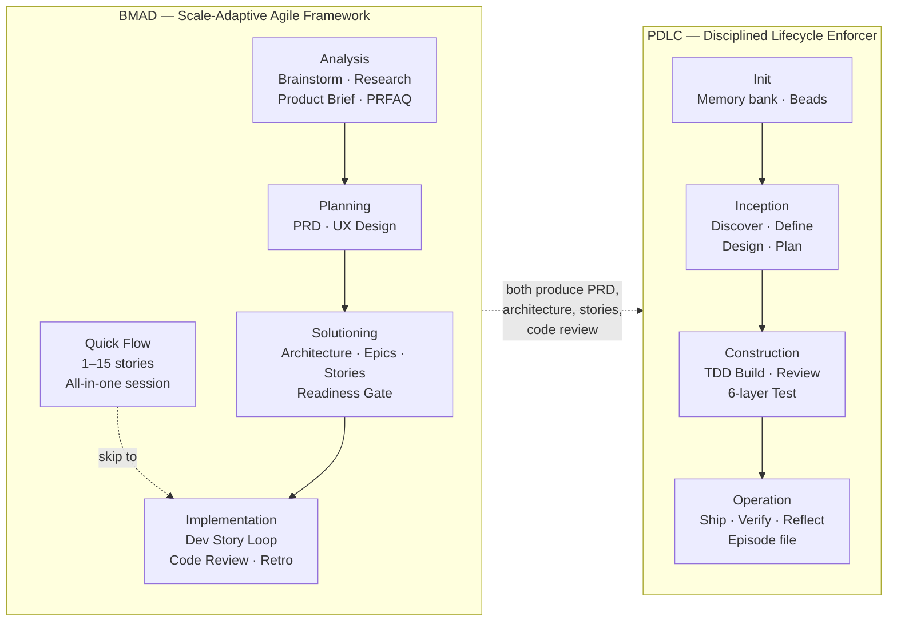
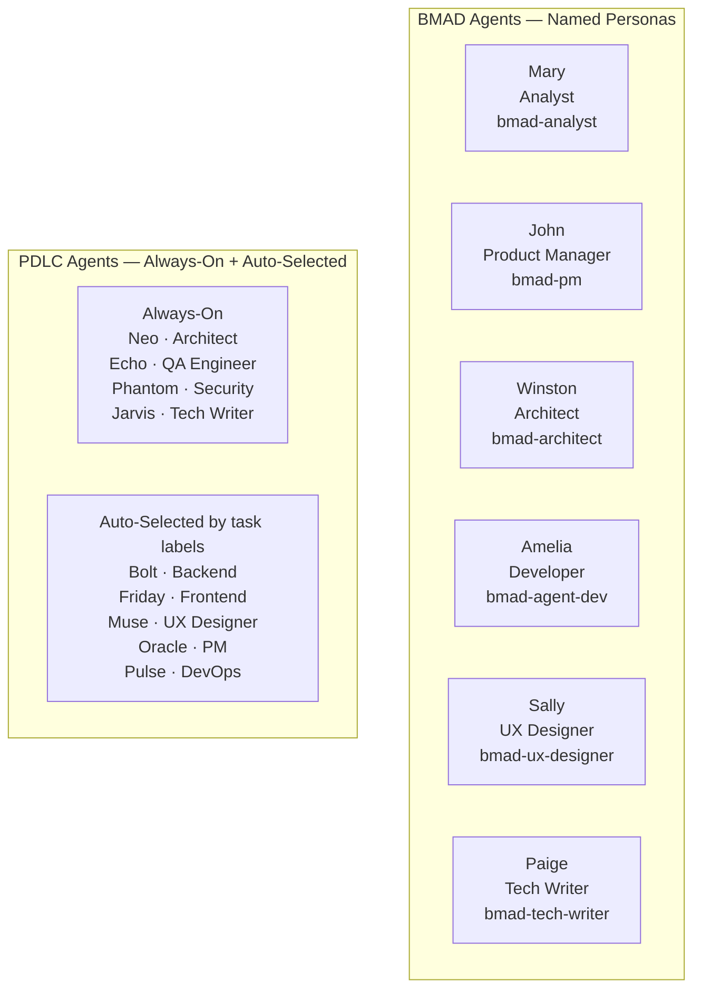
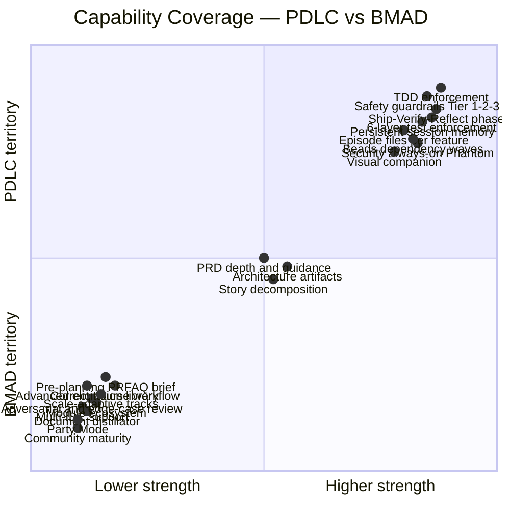

# PDLC vs BMAD-METHOD — Detailed Comparison

## The One-Line Framing

> **PDLC** is a *structured lifecycle enforcer* — it takes a single feature from raw idea through to shipped episode, with hard gates, TDD discipline, safety guardrails, and persistent memory that survives context resets.
>
> **BMAD** is a *scale-adaptive agile framework* — it provides a rich library of 34+ specialized workflows, 6 named agent personas, and three planning tracks that adjust in depth from a one-session bug fix all the way to an enterprise platform.

They are the most comparable frameworks in this space — both cover the full lifecycle from idea to code — but they make opposite bets on *how*: PDLC bets on **depth and discipline** within a single opinionated pipeline; BMAD bets on **breadth and adaptability** across many workflows and scales.

---

## Visual — Structural Overlap

```
┌─────────────────────────────────────────────────────────────────────────────────┐
│                        LIFECYCLE COVERAGE                                       │
│                                                                                 │
│  Idea  →  Analysis  →  Planning  →  Solutioning  →  Implementation  →  Ship    │
│                                                                                 │
│  BMAD: ├──────────────────────────────────────────────────┤  (no ship phase)   │
│        Analysis    Planning      Solutioning    Implementation                  │
│        (Optional)  (Required)    (BMad/Ent)     (Quick/Full)                    │
│                                                                                 │
│  PDLC:                  ├─────────────────────────────────────────────────────┤│
│                      Inception        Construction              Operation        │
│                  Discover·Define·   Build·Review·Test     Ship·Verify·Reflect   │
│                    Design·Plan                                                  │
│                                                                                 │
│  OVERLAP ZONE ──────────────────────────────────────────────────────────────┐  │
│              PRD · Architecture · UX Design · Story breakdown · Code review  │  │
│  ──────────────────────────────────────────────────────────────────────────────┘│
└─────────────────────────────────────────────────────────────────────────────────┘
```



---

## Agent Roster Comparison



| | BMAD | PDLC |
|---|---|---|
| Total agents | 6 (core BMM) + module agents | 9 |
| Named personas | Yes — Mary, John, Winston, Amelia, Sally, Paige | Yes — Neo, Echo, Phantom, Jarvis, Bolt, Friday, Muse, Oracle, Pulse |
| Security reviewer | No (TEA module has risk-based test strategy) | **Yes — Phantom (always-on)** |
| DevOps / deploy | No | **Yes — Pulse (auto-selected)** |
| QA Engineer | Via Amelia / TEA module | **Yes — Echo (always-on)** |
| Activation model | Invoked explicitly per workflow | Always-on (4) + auto-selected by task labels (5) |
| Party Mode | **Yes — all agents discuss together** | No |

---

## Side-by-Side Feature Matrix

| Dimension | PDLC | BMAD-METHOD |
|-----------|------|-------------|
| **Core purpose** | Opinionated lifecycle enforcer with memory and safety | Scale-adaptive agile framework with specialized workflows |
| **Version / maturity** | v0.1.2, early stage | v6.2.2, 43,600 stars, active community |
| **Planning tracks** | Single pipeline | **Three tracks: Quick Flow / BMad Method / Enterprise** |
| **Phase coverage** | Init → Inception → Construction → **Operation (Ship + Verify + Reflect)** | Analysis → Planning → Solutioning → Implementation (no ship phase in core) |
| **TDD enforcement** | **Hard: failing test before implementation, 3-strike loop breaker** | Not enforced at framework level |
| **Test layers** | **6 enforced layers: Unit → Integration → E2E → Perf → A11y → Visual** | TEA optional module (enterprise risk-based test strategy) |
| **Safety guardrails** | **Tier 1/2/3 with hook-based intercepts and double-RED confirm** | None at framework level |
| **Ship / deploy** | **Full: merge commit, CI/CD detection, semver tag, smoke tests, sign-off** | Not in core BMM (TEA has release gates) |
| **Persistent memory** | **STATE.md checkpoint/resume, CONSTITUTION, DECISIONS, OVERVIEW, episode files** | File artifacts + `project-context.md`; fresh chat per workflow (no session resume) |
| **Episode / retrospective** | **Per-feature episode file: what built, decisions, test results, tech debt, retro** | `bmad-retrospective` per epic (post-epic, not per-feature) |
| **Task tracking** | **Beads (bd): dependency graph, wave execution, claim/done** | `sprint-status.yaml` + flat story markdown files |
| **Context recovery** | STATE.md auto-resumes last checkpoint at session start | `bmad-help` scans project and recommends next step |
| **Visual companion** | **Yes — local server, live mockups/diagrams in browser** | No |
| **Advanced reasoning** | No | **Adversarial review, edge-case hunter, advanced elicitation library, pre-mortem, inversion, red team, first principles** |
| **Document tooling** | skills/writing-clearly-and-concisely | **Distillator (lossless compression), shard-doc, index-docs, editorial review (prose + structure)** |
| **Scale adaptability** | Fixed pipeline regardless of scope | **Scale-domain-adaptive: auto-selects depth based on story count** |
| **Party Mode** | No | **Yes — multi-agent group discussion with disagreement** |
| **Pre-planning artifacts** | None beyond Socratic questioning | **Product brief, PRFAQ (Working Backwards), brainstorming report (100+ ideas), domain/market/technical research** |
| **Scope correction** | Not formalized | **`bmad-correct-course` workflow for mid-sprint scope changes** |
| **IDE support** | Claude Code only | **Claude Code, Cursor, Windsurf, others** |
| **Module ecosystem** | npm `@pdlc-os/` scope (early) | **Builder (BMB), Test Architect (TEA), Game Dev Studio, Creative Intelligence Suite** |
| **Brainstorming quality** | 6 Socratic questions + visual companion | **Anti-bias domain rotation every 10 ideas, targeting 100+ ideas** |
| **PRD generation** | Auto-generated from Socratic answers, BDD user stories | PM agent (John) produces `PRD.md` with full guidance |
| **Architecture artifacts** | ARCHITECTURE.md + data-model.md + api-contracts.md | `architecture.md` + `ux-spec.md` |
| **Story format** | Linked to BDD Given/When/Then in PRD | Standalone `story-[slug].md` files with implementation details |
| **License** | MIT | MIT |
| **Community** | npm package, GitHub | **Discord, YouTube, 43k+ stars, dedicated docs site** |

---

## Where Each Excels



### PDLC excels at

- **Operational completeness** — the only framework with a full Ship → Verify → Reflect phase: merge commit strategy, CI/CD auto-detection, smoke tests against the deployed environment, human sign-off, and semver tagging all built-in
- **TDD as a non-negotiable** — failing test before every implementation; 3-strike loop capped with human escalation options; not a guideline, a hard convention
- **Safety at every level** — Tier 1 (double-RED confirm, cannot bypass), Tier 2 (pause+confirm, downgrade-able via CONSTITUTION), Tier 3 (logged warning); hook-based intercepts run on every Bash call
- **Session persistence** — STATE.md means any session starts by resuming the exact last checkpoint; context compaction never loses your position; CONSTITUTION and OVERVIEW survive indefinitely
- **Episodic memory** — every shipped feature produces a structured episode file with what was built, why decisions were made, which tests passed, what tech debt was introduced, and a gstack-style retro; these accumulate into OVERVIEW.md
- **Security always present** — Phantom (Security Reviewer) is on every single task, every review pass; BMAD has no equivalent always-on security role in core BMM
- **Dependency-aware task execution** — Beads provides a real dependency graph; tasks execute in waves; unblocked tasks can run in parallel; blocked tasks wait explicitly
- **Visual brainstorming** — live browser-based companion with mockups, wireframes, architecture diagrams, and click-to-select options during Inception

### BMAD excels at

- **Scale-adaptive intelligence** — genuinely three different workflows for three different scales; a bug fix takes one session with Quick Flow; an enterprise platform gets full PRD + Architecture + UX + security artifacts; PDLC puts every feature through the same pipeline regardless of size
- **Pre-planning depth** — PRFAQ (Amazon Working Backwards), product brief, brainstorming report (targeting 100+ ideas with anti-bias domain rotation), domain/market/technical research; PDLC has only 6 Socratic questions at the start
- **Advanced reasoning toolkit** — adversarial review (must find ≥10 issues), edge-case hunter (mechanically enumerates all branching paths, reports only unhandled cases as JSON), advanced elicitation library (pre-mortem, first principles, inversion, red team, SCAMPER), editorial review for prose and structure; PDLC has writing-clearly-and-concisely but nothing of this depth
- **Party Mode** — all agents brought into one session with natural cross-talk, disagreements, and multi-perspective debate; essential for large architectural decisions or post-mortems; PDLC has no equivalent
- **`bmad-correct-course`** — a dedicated workflow for mid-sprint scope changes; PDLC has no formalized way to handle this
- **Multi-IDE support** — Claude Code, Cursor, Windsurf and others via the same skills architecture; PDLC is Claude Code only
- **Module ecosystem** — Test Architect (TEA) provides 9 enterprise test workflows with risk-based P0–P3 prioritization; Game Dev Studio, Creative Intelligence Suite; a community build-your-own-module path (BMad Builder); PDLC has no module system yet
- **Community and maturity** — 43,600 stars, v6.2.2, dedicated docs site, Discord, YouTube tutorials; PDLC is at v0.1.2
- **Document infrastructure** — distillator (lossless compression for large docs), shard-doc (splits on `##` headers), index-docs; PDLC has no equivalent for managing large specification documents

---

## Gaps in PDLC That BMAD Already Covers

| Gap | What BMAD provides | PDLC's current state |
|-----|--------------------|----------------------|
| **Scale-adaptive planning** | Three tracks: Quick Flow (1 session), BMad Method (full pipeline), Enterprise (+ security/devops artifacts) | Every feature runs the full 4-phase pipeline regardless of complexity |
| **Pre-planning artifacts** | Product brief, PRFAQ (Working Backwards), brainstorming report with 100+ ideas | 6 Socratic questions; no strategic pre-validation step |
| **Adversarial review** | `bmad-review-adversarial-general` must find ≥10 issues; cynical lens, looks for what's missing | Review is structured but not adversarial by design |
| **Edge-case enumeration** | `bmad-review-edge-case-hunter` mechanically enumerates all branching paths; returns only unhandled cases as JSON | Edge cases surfaced through Echo's judgment, not a systematic enumeration |
| **Advanced elicitation** | Named reasoning methods: pre-mortem, first principles, inversion, red team, SCAMPER, reverse brainstorming | Socratic discovery with follow-up questions; no named reasoning methods |
| **Party Mode** | Multi-agent group discussion with natural cross-talk and disagreements on any topic | Agents contribute sequentially during Review; no freeform multi-agent discussion |
| **Scope correction workflow** | `bmad-correct-course` dedicated workflow for significant mid-sprint changes | No formalized path; user would need to manually update PRD and re-plan |
| **Multi-IDE support** | Claude Code, Cursor, Windsurf, others | Claude Code only |
| **Module / extension ecosystem** | BMad Builder creates custom modules; TEA, CIS, GDS available | npm `@pdlc-os/` scope exists but no community modules yet |
| **Document compression** | `bmad-distillator` for lossless LLM-optimized compression with round-trip verification | No equivalent; large docs read at full token cost |
| **Document sharding** | `bmad-shard-doc` splits large docs on `##` headers for context-window management | No equivalent |
| **Editorial review** | Prose review (clarity, Microsoft Style Guide) + structural review (cuts/merges/moves) | `writing-clearly-and-concisely` covers Strunk rules but not editorial structure review |
| **Research workflows** | Domain research, market research, technical research as first-class workflows | External context ingestion (WebFetch, Figma, Notion URLs) but no structured research workflow |
| **Test architecture module** | TEA: 9 workflows, risk-based P0–P3, ATDD, release gates, Murat agent | 6 test layers enforced but no risk-stratification or test architecture planning |

---

## Complementarity — What a Combined System Would Look Like

The two frameworks are not competitors in the same niche — they solve different parts of the problem. BMAD gives you a richer, more adaptive *planning and reasoning* toolkit. PDLC gives you a more disciplined *execution and delivery* pipeline.

```mermaid
flowchart TD
    subgraph BMAD_STRENGTHS ["BMAD — Pre-Build Depth"]
        BM1[PRFAQ + Product Brief\nStrategic validation]
        BM2[100+ idea brainstorming\nAnti-bias domain rotation]
        BM3[Advanced elicitation\nFirst principles · Red team · Pre-mortem]
        BM4[Party Mode\nMulti-agent debate on architecture]
        BM5[Scale-adaptive track selection\nQuick / Method / Enterprise]
        BM6[Adversarial + edge-case review]
        BM7[Document distillator + shard]
    end

    subgraph SHARED ["Shared Ground — Both Do This Well"]
        S1[PRD with requirements and acceptance criteria]
        S2[Architecture design documents]
        S3[Story / task decomposition]
        S4[Code implementation with named agents]
        S5[Code review with multi-agent perspectives]
    end

    subgraph PDLC_STRENGTHS ["PDLC — Execution Discipline"]
        PD1[TDD enforcement\n3-strike loop breaker]
        PD2[Safety guardrails\nTier 1 · 2 · 3 hooks]
        PD3[6-layer test enforcement\nConstitution gates]
        PD4[Ship · Verify · Reflect\nFull operation phase]
        PD5[Semver + CI/CD auto-detect\ngit tag management]
        PD6[Persistent session memory\nCheckpoint resume]
        PD7[Episode files\nPer-feature retrospective memory]
        PD8[Dependency-wave execution\nBeads task graph]
    end

    BMAD_STRENGTHS --> SHARED --> PDLC_STRENGTHS

    style BMAD_STRENGTHS fill:#2d1b4e,color:#e2e8f0
    style SHARED fill:#1e3550,color:#e2e8f0
    style PDLC_STRENGTHS fill:#1a3a1a,color:#e2e8f0
```



**The ideal combined pipeline would look like:**

1. **BMAD for pre-Inception** — PRFAQ stress-test + product brief before committing to a feature; adversarial review of the PRD before moving to design; Party Mode for major architectural decisions
2. **PDLC for Inception through Operation** — Socratic discovery (with BMAD's advanced elicitation methods folded in), PRD approval gate, design, plan, TDD build, 6-layer test, ship, verify, reflect, episode file
3. **BMAD's document infrastructure** — distillator and shard-doc for managing large specs that accumulate over many features; PDLC's OVERVIEW.md and DECISIONS.md could benefit from compression
4. **BMAD's scale-adaptive tracks as a pre-gate** — Quick Flow path in PDLC for bug fixes and minor features (skip Inception, go straight to Construction with a thin spec); full pipeline only for features meeting a story-count threshold

---

## Summary Scorecard

| Category | PDLC | BMAD |
|----------|------|------|
| Pre-planning / strategic validation | ⭐⭐ | ⭐⭐⭐⭐⭐ |
| Brainstorming depth | ⭐⭐⭐ | ⭐⭐⭐⭐⭐ |
| PRD generation quality | ⭐⭐⭐⭐ | ⭐⭐⭐⭐ |
| Architecture artifacts | ⭐⭐⭐⭐ | ⭐⭐⭐⭐ |
| Scale adaptability | ⭐⭐ | ⭐⭐⭐⭐⭐ |
| TDD enforcement | ⭐⭐⭐⭐⭐ | ⭐⭐ |
| Test coverage depth | ⭐⭐⭐⭐⭐ | ⭐⭐⭐ (TEA module) |
| Safety guardrails | ⭐⭐⭐⭐⭐ | ⭐ |
| Ship / deploy / release | ⭐⭐⭐⭐⭐ | ⭐⭐ |
| Persistent cross-session memory | ⭐⭐⭐⭐⭐ | ⭐⭐⭐ |
| Episodic feature memory | ⭐⭐⭐⭐⭐ | ⭐⭐ |
| Agent diversity and specialisation | ⭐⭐⭐⭐ | ⭐⭐⭐⭐ |
| Advanced reasoning tools | ⭐⭐ | ⭐⭐⭐⭐⭐ |
| Party Mode / multi-agent debate | ⭐ | ⭐⭐⭐⭐⭐ |
| Document infrastructure | ⭐⭐ | ⭐⭐⭐⭐⭐ |
| Multi-IDE support | ⭐⭐ | ⭐⭐⭐⭐⭐ |
| Module / extension ecosystem | ⭐⭐ | ⭐⭐⭐⭐⭐ |
| Community / maturity | ⭐⭐ | ⭐⭐⭐⭐⭐ |
| Visual companion | ⭐⭐⭐⭐⭐ | ⭐ |
| Task dependency + wave execution | ⭐⭐⭐⭐⭐ | ⭐⭐ |
