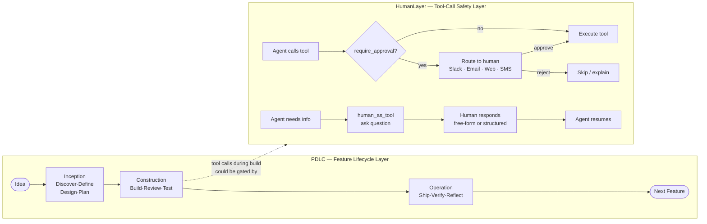
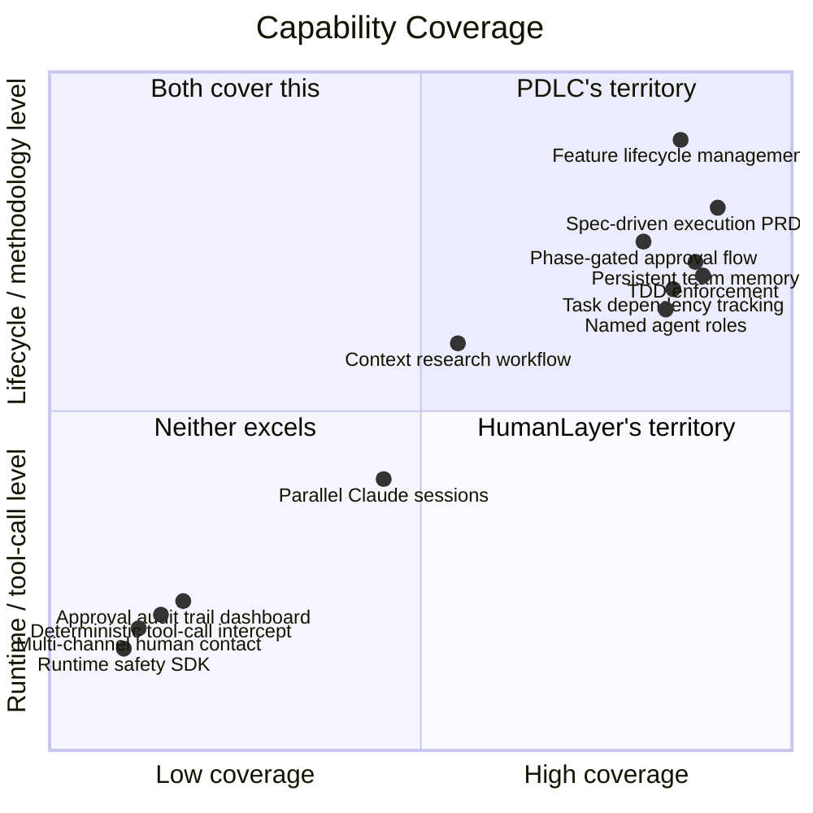

# PDLC vs HumanLayer — Detailed Comparison

## The One-Line Framing

> **PDLC** is a *methodology framework* — it tells you *what to do and when* across the full lifecycle of a feature, from idea to shipped.
>
> **HumanLayer** is an *infrastructure layer* — it tells you *how to safely intercept and escalate* individual agent actions to a human at runtime.

They operate at different altitudes. PDLC is the flight plan. HumanLayer is the air traffic control system for dangerous manoeuvres.

---

## Visual — Altitude Comparison

```
┌─────────────────────────────────────────────────────────────────────┐
│                       FEATURE LIFECYCLE                             │
│                                                                     │
│  Idea → Inception → Construction → Operation → Shipped Episode      │
│  ←──────────────────── PDLC covers this ──────────────────────────→ │
│                                                                     │
│         Within any task execution:                                  │
│         Agent picks up task                                         │
│           → calls tool: write file / run migration / send webhook  │
│           ←──── HumanLayer covers this (approve / reject) ────────→│
│                                                                     │
└─────────────────────────────────────────────────────────────────────┘
```



---

## Side-by-Side Feature Matrix

| Dimension | PDLC | HumanLayer / CodeLayer |
|-----------|------|------------------------|
| **Primary abstraction** | Feature lifecycle phases | Tool-call approval + session orchestration |
| **Scope** | From raw idea to shipped episode | From agent tool call to human response |
| **Human gates — when** | Phase transitions (PRD, Design, Plan, Review, Ship, Reflect) | Any individual tool call, at any point |
| **Human gates — how** | Claude waits for chat response | Slack, Email, Web embed, SMS, CLI — multi-channel, composable |
| **Human gates — guaranteed?** | Convention-based (Claude must ask) | Deterministic intercept (baked into the tool wrapper, LLM cannot bypass) |
| **Agent roles** | Named specialist team (Neo, Echo, Phantom, Jarvis…) | No named roles; any Claude Code session |
| **Parallel agents** | Sub-agent mode per task; wave-based Beads execution | Multi-Claude sessions + Git worktrees (CodeLayer) |
| **Memory / context** | File-based: CONSTITUTION, STATE, DECISIONS, OVERVIEW, episode files | Thoughts system: structured research/plan files in a separate git repo |
| **Spec-driven execution** | PRD → BDD user stories → acceptance criteria → tasks | Research → Plan (with back-and-forth) → Implement |
| **TDD enforcement** | Hard convention: failing test before implementation, 3-strike cap | Not enforced at framework level |
| **Safety tiers** | Tier 1 (red double-confirm) / Tier 2 (pause+confirm) / Tier 3 (logged) | Single-level: `require_approval` wraps any function |
| **Audit trail** | STATE.md, CHANGELOG.md, DECISIONS.md, episode files (per-feature) | Run IDs, Call IDs, dashboard, thoughts repo |
| **Task tracking** | Beads (`bd`) — dependency graph, wave execution, claim/done | No built-in task tracker |
| **CI/CD integration** | Pulse detects and triggers deploy commands | Not in scope |
| **Test layers** | 6 explicit layers (Unit → Integration → E2E → Perf → A11y → Visual) | Not in scope |
| **Versioning** | Semver auto-determination + git tag | Not in scope |
| **Installation** | `npx @pdlc-os/pdlc install` (Claude Code plugin) | `brew install --cask codelayer` (IDE) or npm SDK |
| **Primary user** | Small team (2–5 engineers) using Claude Code | Individual engineer or pair; SDK users building agent systems |
| **Open source** | MIT | Apache 2 |
| **Maturity** | v0.1.2, active development | 10k+ stars, pivoted from SDK to IDE |

---

## Where Each Excels



### PDLC excels at

- **End-to-end feature methodology** — the only framework that takes you from raw idea through Inception (PRD, design, plan), Construction (TDD, review, 6-layer testing), and Operation (ship, verify, reflect) with explicit gates at every step
- **Persistent memory** — CONSTITUTION, INTENT, STATE, OVERVIEW, DECISIONS, and episodic memory survive context resets; the next session picks up exactly where the last one left off
- **Named specialist agents** — Neo, Echo, Phantom, Jarvis etc. embody specific disciplines; their perspectives are structured into the review and build phases
- **TDD as a hard convention** — failing test before implementation; 3-strike cap before human escalation; not optional
- **Task dependency and wave execution** — Beads tracks which tasks are unblocked, which are in progress, which are done; supports true parallel work across a small team
- **Episodic memory** — every shipped feature has a structured record: what was built, decisions made, tests run, tech debt accrued, retro notes

### HumanLayer excels at

- **Deterministic approval intercept** — `require_approval(fn)` wraps the actual function at the infrastructure level; the LLM *cannot* bypass it; PDLC's gates are prompting conventions that a sufficiently confused Claude *could* skip
- **Multi-channel human routing** — Slack, Email, Web, SMS, CLI, composable `any_of` / `all_of` — PDLC has no notion of *where* the human responds, only that they must
- **Asynchronous approval workflows** — a human can approve a production database migration from Slack three hours after the agent requested it; PDLC blocks synchronously in the chat session
- **Programmatic API surface** — `require_approval` and `human_as_tool` are code primitives that any agent framework (LangChain, CrewAI, Vercel AI, OpenAI) can use; PDLC is Claude Code–specific
- **Multi-session orchestration** (CodeLayer) — launch and manage multiple parallel Claude Code sessions with worktrees; PDLC runs within a single session

---

## Gaps in PDLC That HumanLayer Already Solves

| Gap | What HumanLayer provides | PDLC's current state |
|-----|--------------------------|----------------------|
| **Approval channel independence** | Any channel: Slack, Email, Web, SMS. The human doesn't need to be in the chat window | All gates require the human to be actively present in the Claude Code session |
| **Asynchronous gates** | Agent submits approval request and goes idle; human responds hours later; agent resumes | PDLC blocks the session — if you step away mid-review, the session stalls |
| **Deterministic bypass-proof intercepts** | The function wrapper is at the infrastructure level, not the prompt level | PDLC's Tier 1/2/3 safety is a guardrails hook + prompt convention — a sufficiently hallucinating Claude could proceed past it |
| **Cross-framework portability** | SDK works with any LLM framework — LangChain, CrewAI, Vercel AI, plain OpenAI | Locked to Claude Code |
| **Approval audit dashboard** | Web UI shows pending/approved/rejected calls with full history, run IDs, call IDs | No dashboard; STATE.md is the only record, inside the repo |
| **Structured human responses** | `human_as_tool` can constrain what options the human sees (A/B/C/free-text), not just free-form chat | PDLC approval gates are free-text chat responses |
| **Parallel session management** | CodeLayer manages multiple Claude Code processes simultaneously | One session at a time |
| **External agent integration** | Any agent calling any tool can use `require_approval` | Only Claude Code agents using PDLC skills |

---

## Complementarity — What a Combined System Would Look Like

```mermaid
flowchart TD
    subgraph PDLC_LAYER ["PDLC — Methodology & Memory"]
        INIT[/init\nScaffold memory bank]
        BRAINSTORM[/brainstorm\nInception phase]
        BUILD[/build\nConstruction phase]
        SHIP[/ship\nOperation phase]
    end

    subgraph HL_LAYER ["HumanLayer — Safety & Routing"]
        GATE1["require_approval\nfor Tier 1 operations\ndrop table · force push"]
        GATE2["require_approval\nfor Tier 2 operations\nrm -rf · prod migration"]
        CONSULT["human_as_tool\nfor 3-strike escalations\nor mid-task questions"]
        CHANNEL["Route to human via\nSlack · Email · Web\nasync — no blocking"]
    end

    BUILD -->|"Tier 1 tool call detected"| GATE1
    BUILD -->|"Tier 2 tool call detected"| GATE2
    BUILD -->|"3-strike limit hit"| CONSULT
    GATE1 & GATE2 & CONSULT --> CHANNEL
    CHANNEL -->|"Human approves/rejects/guides"| BUILD

    style PDLC_LAYER fill:#1e3550,color:#e2e8f0
    style HL_LAYER fill:#2d1b4e,color:#e2e8f0
```

In this combined model: PDLC provides the workflow structure, memory, and methodology discipline; HumanLayer replaces PDLC's convention-based safety hooks with infrastructure-level intercepts that route to wherever the human actually is — Slack, email, mobile — without requiring them to be sitting in the chat window.

The most natural integration points are:

1. **PDLC's Tier 1 and Tier 2 guardrails** (`hooks/pdlc-guardrails.js`) — currently block the chat session waiting for a typed response; HumanLayer's `require_approval` channel would make those genuinely async and deliverable to any channel
2. **The 3-strike Construction escalation** — currently surfaces as a chat prompt; `human_as_tool` with structured options (A/B/C) would give the human a richer, channel-independent way to guide the next attempt
3. **Phase approval gates** — PRD approval, Design approval, Ship confirmation — these are currently synchronous chat responses; routing them through HumanLayer would allow the team to review and approve from Slack or email without being in the Claude Code session
