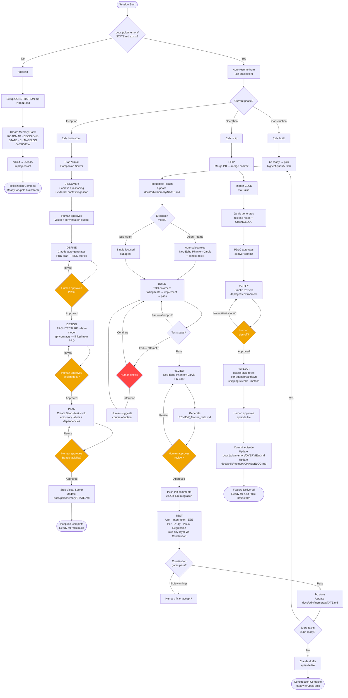

# PDLC Flow Diagram

```mermaid
flowchart TD
    START([Session Start]) --> RESUME{docs/pdlc/memory/\nSTATE.md exists?}
    RESUME -->|No| INIT
    RESUME -->|Yes| AUTOLOAD[Auto-resume from\nlast checkpoint]
    AUTOLOAD --> PHASE_CHECK{Current phase?}
    PHASE_CHECK -->|Inception| INCEPTION
    PHASE_CHECK -->|Construction| CONSTRUCTION
    PHASE_CHECK -->|Operation| OPERATION

    %% PHASE 0 — INITIALIZATION
    INIT["/pdlc init"] --> I1[Setup CONSTITUTION.md\nINTENT.md]
    I1 --> I2[Create Memory Bank\nROADMAP · DECISIONS\nSTATE · CHANGELOG\nOVERVIEW]
    I2 --> I3[bd init → .beads/\nin project root]
    I3 --> I4([Initialization Complete\nReady for /pdlc brainstorm])

    %% PHASE 1 — INCEPTION
    INCEPTION["/pdlc brainstorm"] --> D1[Start Visual\nCompanion Server]
    D1 --> D2[DISCOVER\nSocratic questioning\n+ external context ingestion]
    D2 --> D3[Human approves\nvisual + conversation output]
    D3 --> D4[DEFINE\nClaude auto-generates\nPRD draft — BDD stories]
    D4 --> D5{Human approves\nPRD?}
    D5 -->|Revise| D4
    D5 -->|Approved| D6[DESIGN\nARCHITECTURE · data-model\napi-contracts — linked from PRD]
    D6 --> D7{Human approves\ndesign docs?}
    D7 -->|Revise| D6
    D7 -->|Approved| D8[PLAN\nCreate Beads tasks with\nepic·story labels + dependencies]
    D8 --> D9{Human approves\nBeads task list?}
    D9 -->|Revise| D8
    D9 -->|Approved| D10[Stop Visual Server\nUpdate docs/pdlc/memory/STATE.md]
    D10 --> D11([Inception Complete\nReady for /pdlc build])

    %% PHASE 2 — CONSTRUCTION
    CONSTRUCTION["/pdlc build"] --> C1[bd ready → pick\nhighest-priority task]
    C1 --> C2[bd update --claim\nUpdate docs/pdlc/memory/STATE.md]
    C2 --> C3{Execution\nmode?}
    C3 -->|Agent Teams| C4[Auto-select roles\nNeo·Echo·Phantom·Jarvis\n+ context roles]
    C3 -->|Sub-Agent| C5[Single focused\nsubagent]
    C4 & C5 --> C6[BUILD\nTDD enforced:\nfailing tests → implement → pass]
    C6 --> C7{Tests pass?}
    C7 -->|Fail — attempt ≤3| C6
    C7 -->|Fail — attempt 3| C8{Human choice}
    C8 -->|Continue| C6
    C8 -->|Intervene| C9[Human suggests\ncourse of action]
    C9 --> C6
    C7 -->|Pass| C10[REVIEW\nNeo·Echo·Phantom·Jarvis\n+ builder]
    C10 --> C11[Generate\nREVIEW_feature_date.md]
    C11 --> C12{Human approves\nreview?}
    C12 -->|Revise| C10
    C12 -->|Approved| C13[Push PR comments\nvia GitHub integration]
    C13 --> C14[TEST\nUnit · Integration · E2E\nPerf · A11y · Visual Regression\nskip any layer via Constitution]
    C14 --> C15{Constitution\ngates pass?}
    C15 -->|Soft warnings| C16[Human: fix or accept?]
    C16 --> C15
    C15 -->|Pass| C17[bd done\nUpdate docs/pdlc/memory/STATE.md]
    C17 --> C18{More tasks\nin bd ready?}
    C18 -->|Yes| C1
    C18 -->|No| C19[Claude drafts\nepisode file]
    C19 --> C20([Construction Complete\nReady for /pdlc ship])

    %% PHASE 3 — OPERATION
    OPERATION["/pdlc ship"] --> O1[SHIP\nMerge PR — merge commit]
    O1 --> O2[Trigger CI/CD\nvia Pulse]
    O2 --> O3[Jarvis generates\nrelease notes + CHANGELOG]
    O3 --> O4[PDLC auto-tags\nsemver commit]
    O4 --> O5[VERIFY\nSmoke tests vs\ndeployed environment]
    O5 --> O6{Human\nsign-off?}
    O6 -->|No — issues found| O5
    O6 -->|Approved| O7[REFLECT\ngstack-style retro:\nper-agent breakdown\nshipping streaks · metrics]
    O7 --> O8[Human approves\nepisode file]
    O8 --> O9[Commit episode\nUpdate docs/pdlc/memory/OVERVIEW.md\nUpdate docs/pdlc/memory/CHANGELOG.md]
    O9 --> O10([Feature Delivered\nReady for next /pdlc brainstorm])

    %% SAFETY GUARDRAILS
    style C8 fill:#ff4444,color:#fff
    style D5 fill:#f0a500,color:#fff
    style D7 fill:#f0a500,color:#fff
    style D9 fill:#f0a500,color:#fff
    style C12 fill:#f0a500,color:#fff
    style O6 fill:#f0a500,color:#fff
```
