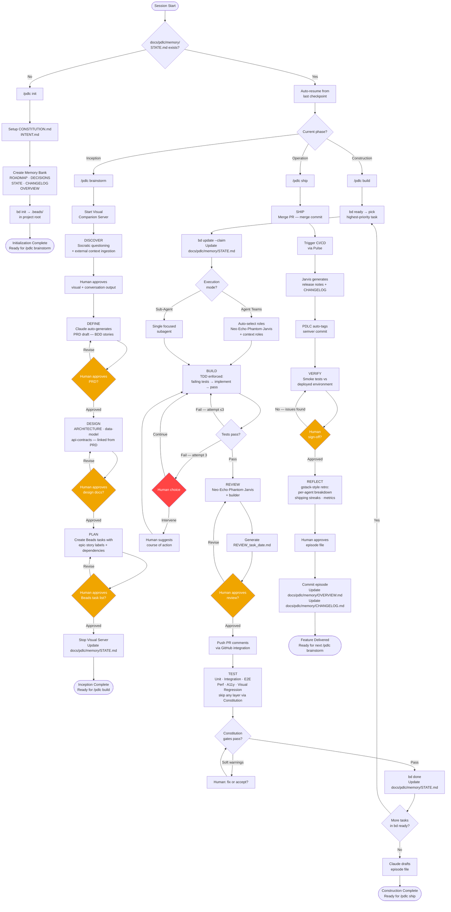

# PDLC — Product Development Lifecycle Plugin

> A hybrid Claude Code plugin combining the best of obra/superpowers, gstack, and get-shit-done-cc.

## Status: Planning Phase (In Progress)

---

## Source Plugins — What We're Drawing From

| Plugin | Primary Strength |
|--------|-----------------|
| **obra/superpowers** | Methodology discipline: TDD, systematic debugging, subagent reviews, worktrees |
| **gstack** | Specialist roles, sprint workflow, real browser automation, safety guardrails |
| **get-shit-done-cc** | Context rot prevention, spec-driven execution, file-based state, multi-agent waves |

---

## Design Decisions (TBD via planning session)

### 1. Name & Scope
- [x] What does "pdlc" stand for? → **Product Development Lifecycle**
- [x] Target audience → **Small startup team (2–5 engineers)**: real people exist but Claude fills gaps and accelerates each phase
- [x] Installation method → **Both global (npm) + project-local (CLAUDE.md)**, distributed via a GitHub marketplace called **pdlc-os** (open ecosystem)

### 2. Core Philosophy
- [x] **Opinionated vs configurable**: Strong defaults, all overridable via `CONSTITUTION.md`
- [x] **Approval gates** (PDLC pauses and waits for human at each):
  - End of Discover → human approves PRD draft
  - End of Design → human approves design docs
  - End of Plan → human approves Beads task list
  - End of Review → human approves review file before PR comments posted
  - After 3 fix-loop failures → human chooses: continue automatically or intervene
  - Ship → human approves merge + deploy
  - Verify → human sign-off after smoke tests
  - Reflect → human reads and closes episode

### 3. Lifecycle Phases
- [x] **Phase 0 — Initialization**: Constitution (app rules), Intent (core idea), Memory Bank (markdown files, kept in sync across all phases)
- [x] **Phase 1 — Inception**: Discover + Define + Design + Plan
- [x] **Phase 2 — Construction**: Build + Review + Test
- [x] **Phase 3 — Operation**: Ship + Verify + Reflect

### 4. Safety Guardrails

**Tier 1 — Hard blocks** (overridable, but requires **double confirmation in RED highlighted text**):
- Force-pushing to `main`
- Dropping database tables without explicit migration file
- Deleting files not created in the current feature branch
- Deploying with failing smoke tests

**Tier 2 — Pause & confirm** (default: stop and wait for explicit yes; can be downgraded to Tier 3 via `CONSTITUTION.md`):
- Any `rm -rf` or bulk delete
- `git reset --hard`
- Running DB migrations in production
- Changing `CONSTITUTION.md`
- Closing all open Beads tasks at once
- Any external API call that writes/posts/sends (Slack, email, webhooks)

**Tier 3 — Logged warnings** (PDLC proceeds, records in `docs/pdlc/memory/STATE.md`):
- Skipping a test layer
- Overriding a Constitution rule
- Accepting a Phantom security warning without fixing
- Accepting an Echo test coverage gap

### pdlc-os Marketplace Contents
- [x] Workflow templates (SaaS MVP, API service, mobile app, data pipeline, etc.)
- [x] Role packs (specialist roles beyond defaults)
- [x] Tech stack adapters (Next.js+Supabase, Rails+Postgres, FastAPI+React, etc.)
- [x] Integration plugins (Linear, Notion, GitHub Issues, Slack, Figma)
- [x] Custom skill packs (HIPAA, SEO, perf budgets, accessibility, etc.)
- [x] **Curation model**: Open publishing with curated tier
  - Anyone can publish, namespaced by author (`@username/pack-name`)
  - `pdlc-os/verified` badge for packages reviewed by maintainers
  - **Declared permissions** required on every package (e.g. "makes outbound calls to Linear API", "reads filesystem", "writes to GitHub")
  - PDLC warns at install time when a package is unverified
  - PDLC shows declared permissions at install time and asks for confirmation

---

## Features

### Initialization Phase

#### Memory Bank Structure

All PDLC-generated files live under `docs/pdlc/` in the repo:

```
docs/pdlc/
  memory/
    CONSTITUTION.md
    INTENT.md
    ROADMAP.md
    DECISIONS.md
    STATE.md
    CHANGELOG.md
    OVERVIEW.md
    episodes/
      001_user_auth_2026-04-03.md
      002_billing_integration_2026-04-10.md
      index.md
  prds/
    PRD_[feature-name]_[YYYY-MM-DD].md
    plans/
      plan_[feature-name]_[YYYY-MM-DD].md
  design/
    [feature-name]/
      ARCHITECTURE.md
      data-model.md
      api-contracts.md
  reviews/
    REVIEW_[task-id]_[YYYY-MM-DD].md
```

**Persistent Memory** (`docs/pdlc/memory/`):
- `CONSTITUTION.md` — rules, standards, constraints, definition of done
- `INTENT.md` — core idea, problem statement, target user, value prop
- `ROADMAP.md` — phase-by-phase plan
- `DECISIONS.md` — architectural decision log (ADR-style)
- `STATE.md` — current phase, active tasks, blockers
- `CHANGELOG.md` — what shipped and when
- `OVERVIEW.md` — **aggregated view** of all changes and functionality delivered across every iteration; updated automatically after each successful merge to main

**Episodic Memory** (`docs/pdlc/memory/episodes/`):
```
docs/pdlc/memory/episodes/
  001_user_auth_2026-04-03.md
  002_billing_integration_2026-04-10.md
  index.md   ← searchable index of all episodes
```

Each episode file captures:
- Feature name & episode ID
- Date delivered
- Phase delivered in
- What was built (summary)
- Link to associated PRD
- Link to PR
- Key decisions made & why
- Files/modules created or changed
- Test summary: passed tests, failed tests
- Known tradeoffs / tech debt introduced

**Episode trigger**: every time a feature is changed or functionality enhanced, culminating in a successful commit → PR approval → merge to main.

**Authorship**: Claude drafts the episode file; human reviews and approves or suggests changes before it is committed.

---

### Inception Phase

#### Discover Sub-phase
- **Socratic method**: Claude asks structured probing questions to surface assumptions, constraints, and gaps before any output is produced
- **Full Discover pass** on every feature (not just initial product setup)
- **Visual companion**: local dev server (localhost URL, random high port) active **only during Inception phase**
  - Node.js + HTTP + WebSocket (adopted from superpowers)
  - Claude writes HTML fragments to a watched dir → browser auto-reloads via WebSocket (100ms debounce)
  - Renders: Mermaid flowcharts, entity diagrams, DB structures, UX mockups, user journeys, design ideas
  - Component system: options/cards/mockups/split views/wireframes/pros-cons
  - User choices captured via `data-choice` elements → WebSocket events → Claude reads and responds
  - Auto-exits after 30min inactivity; shuts down when Inception phase ends
  - No export in MVP (future release)
- **External context ingestion**:
  - Web search (research, competitive analysis)
  - Figma (design context, user flows)
  - Notion (docs, wikis)
  - Word docs via shared OneDrive
  - Extensible via pdlc-os integration plugins
- **Output**: `docs/pdlc/prds/PRD_[feature-name]_[YYYY-MM-DD].md`

#### Define Sub-phase
- **Single PRD per feature**: `docs/pdlc/prds/PRD_[feature-name]_[YYYY-MM-DD].md`
- Claude **auto-generates draft PRD** at end of Discover based on Socratic conversation + visual choices
- PRD sections: overview, requirements, assumptions, acceptance criteria, user stories (BDD), non-functional requirements, out-of-scope
- **User stories in BDD format**: Given / When / Then
- Human reviews and approves draft before moving to Design

#### Design Sub-phase
- PRD references design docs but they live as **separate files per feature**:
  - `docs/pdlc/design/[feature-name]/ARCHITECTURE.md`
  - `docs/pdlc/design/[feature-name]/data-model.md`
  - `docs/pdlc/design/[feature-name]/api-contracts.md`
  - Additional files as needed (UI direction, sequence diagrams, etc.)
- Design docs are linked from the PRD
- Visual companion server still active — renders architecture diagrams, data models, UI wireframes

#### Plan Sub-phase
- **Plan file**: `docs/pdlc/prds/plans/plan_[feature-name]_[YYYY-MM-DD].md`
- **Task format**: Flat tasks with labels for epic and user story they belong to
- **Task management**: [Beads (bd)](https://github.com/gastownhall/beads) — a distributed graph issue tracker built for AI agents
  - Initialized **once during Initialization phase** via `bd init` → creates `.beads/` in project root
  - Tasks created via `bd create` with full metadata: title, description, acceptance criteria, labels, dependencies
  - Labels used for: epic (`epic:[name]`), user story (`story:[id]`), tech domain (`backend`, `frontend`, etc.)
  - Dependencies set via `bd dep add` to express blocking relationships
  - **Wave-based parallel execution** emerges naturally from Beads' ready queue: `bd ready` shows only unblocked tasks; all ready tasks run in parallel, enforcing wave ordering via `blocks` dependencies
  - Claude uses `bd ready --json` to pick next tasks; `bd update --claim` atomically claims; `bd done` closes on completion
  - `bd dep tree` generates Mermaid dependency visualization for the visual companion server

### Construction Phase

#### Build Sub-phase
- **Git strategy**: One branch per feature (`feature/[feature-name]`); all tasks land on the feature branch; single PR to main at end
- **TDD**: Enforced (superpowers-style) — Claude must write failing tests before any implementation code; no exceptions without explicit human override
- **Execution model**: Sequential with fast switching — Claude works through `bd ready` queue by priority, one task at a time
  - When a task is claimed, **human chooses execution mode**:
    - **(Agent Teams)** — multiple specialist agents collaborate on the task (e.g. backend agent + frontend agent + QA agent working in concert, inspired by gstack roles)
    - **(Sub-Agent)** — single focused subagent handles the task end-to-end (superpowers approach)

#### Agent Teams — Role Roster

**Always-on** (participate in every task regardless of scope):
| Role | Name | Responsibility |
|------|------|----------------|
| Architect | **Neo** | High-level design, cross-cutting concerns, tech debt radar |
| QA Engineer | **Echo** | Test strategy, edge cases, regression coverage |
| Security Reviewer | **Phantom** | Auth, input validation, OWASP checks |
| Tech Writer | **Jarvis** | Inline docs, API docs, changelogs |

**Auto-selected** (PDLC picks based on task labels & scope):
| Role | Name | Responsibility |
|------|------|----------------|
| Backend Engineer | **Bolt** | API, services, DB, business logic |
| Frontend Engineer | **Friday** | UI components, state, UX implementation |
| UX Designer | **Muse** | User experience, flows, interaction design |
| PM | **Oracle** | Requirements clarity, scope, acceptance criteria |
| DevOps | **Pulse** | CI/CD, infra, deployment, environment config |

#### Review Sub-phase
- **Reviewers**: Always-on team (Neo, Echo, Phantom, Jarvis) + the agent(s) who built the task
  - **Neo** — architecture & PRD conformance check
  - **Phantom** — security pass (OWASP, auth, input validation)
  - **Echo** — test coverage and quality verification
  - **Jarvis** — docs completeness check
- **Review output**:
  1. Claude generates `docs/pdlc/reviews/REVIEW_[task-id]_[YYYY-MM-DD].md` with all findings
  2. Human reviews the markdown file and approves or suggests changes
  3. After human approval, PDLC optionally pushes findings as PR comments via GitHub integration
- **Issue severity**:
  - **Soft warnings only** — security issues and test coverage gaps are flagged but do not hard-block
  - Human decides: fix now, accept and move on, or defer to tech debt

#### Auto-fix Loop Breaker (Construction-wide)
- When Claude enters a bug-fix loop during Construction (build → test → fix → test → fix…):
  - Maximum **3 automatic fix attempts** per issue
  - On the 3rd failed attempt, PDLC pauses and presents the human with a choice:
    - **(A) Continue automatically** — let Claude keep trying
    - **(B) Human takes the wheel** — human reviews the error, suggests a course of action, Claude resumes with that guidance

#### Test Sub-phase
- **Test layers** (all active by default; any layer can be skipped via human instruction or Constitution config):
  1. Unit tests (already written during TDD in Build — re-run for full confirmation)
  2. Integration tests
  3. E2E tests — **real Chromium instance** (gstack approach, not a simulator)
  4. Performance / load tests
  5. Accessibility checks
  6. Visual regression tests (screenshot diffing)
- **Test gate**: Human-defined in `CONSTITUTION.md` — specifies which layers must pass before Operation can begin
- **Test reporting**: Results (passed, failed, skipped per layer) written into the **episode file** (`docs/pdlc/memory/episodes/`) as part of the episode summary Claude drafts at end of Construction

---

### Operation Phase

#### Ship Sub-phase
- Merge PR to main (automated once Constitution test gates pass + human approves)
- Trigger CI/CD pipeline (coordinated by **Pulse**)
- Generate release notes and `CHANGELOG.md` entry (**Jarvis**)
- Tag git commit with semantic version (auto-managed by PDLC — see Versioning below)
- **Merge strategy**: Merge commit (preserves full branch history)
- **Semantic versioning**: PDLC auto-determines patch / minor / major based on what was shipped:
  - Patch — bug fixes, minor tweaks
  - Minor — new features, backwards-compatible
  - Major — breaking changes, architectural shifts

#### Verify Sub-phase
- Automated smoke tests run against the deployed environment
- Manual human sign-off required before Reflect begins

#### Reflect Sub-phase
- gstack-style retro generated by Claude:
  - Per-person (per-agent) breakdown of contributions
  - Shipping streaks tracking
  - What went well, what broke, what to improve
  - Metrics snapshot (test pass rate, cycle time, issues encountered)
- Reflect output feeds into the **episode file** and updates `docs/pdlc/memory/OVERVIEW.md`

---

## Architecture

### Invocation Model
| Command | Phase | Description |
|---------|-------|-------------|
| `/pdlc init` | Initialization | First-time setup: Constitution, Intent, Memory Bank, Beads |
| `/pdlc brainstorm` | Inception | Discover → Define → Design → Plan for a feature |
| `/pdlc build` | Construction | Build → Review → Test for current feature |
| `/pdlc ship` | Operation | Ship → Verify → Reflect |
| *(resume)* | Auto-detect | If no command given, PDLC reads `docs/pdlc/memory/STATE.md` and resumes from last checkpoint |

### Plugin Primitives
- **Skills** — markdown skill files per phase, per role (Neo, Oracle, Bolt, Friday, Echo, Phantom, Muse, Pulse, Jarvis), and per capability (TDD, review, test, ship, reflect)
- **Hooks** — fire on events to: enforce guardrails (pre-tool), update `docs/pdlc/memory/STATE.md` (post-tool), sync Beads status on task pick-up and completion (post-tool), trigger episode drafting on PR merge
- **MCP servers** — visual companion server (Inception), Beads integration, real Chromium browser (E2E tests)
- **CLAUDE.md** — project-local config: active phase, current feature, pointers to `docs/pdlc/memory/CONSTITUTION.md` and `docs/pdlc/memory/STATE.md`

### Status Bar (JavaScript Hooks)

Two hooks registered in `~/.claude/settings.json` (global) and/or `.claude/settings.json` (project-local):

#### `hooks/pdlc-statusline.js` — `statusLine` hook
Runs continuously; output displayed in Claude Code's status bar.

**Displays:**
```
[Phase] │ [Active Task] │ [Project] │ [████████░░] Context %
```

Example:
```
Construction │ bd-a1b2: Add auth middleware │ my-app │ ██████░░░░ 58%
```

- **Phase** — read from `docs/pdlc/memory/STATE.md` (Initialization / Inception / Construction / Operation)
- **Active task** — read from `docs/pdlc/memory/STATE.md` (current Beads task ID + title)
- **Context bar** — color-coded progress bar with corrected scaling (fixes GSD issue #769's hardcoded 80% factor):
  - Green `<50%` used
  - Yellow `50–65%`
  - Orange `65–80%`
  - Blinking red + warning `80%+`
- **Bridge file** written to `/tmp/pdlc-ctx-{session_id}.json` for context monitor to read

#### `hooks/pdlc-context-monitor.js` — `PostToolUse` hook
Fires after every tool execution; injects warnings into the conversation via `additionalContext`.

- **≤35% remaining** → WARNING: "Context filling up — PDLC recommends wrapping up current task and updating docs/pdlc/memory/STATE.md"
- **≤25% remaining** → CRITICAL: "Context critically low — PDLC will preserve state and pause after this task"
- Debounced: warns every 5 tool uses to avoid spam; CRITICAL bypasses debounce
- On CRITICAL, PDLC auto-updates `docs/pdlc/memory/STATE.md` with current position before context compacts

### Beads Lifecycle Integration
- Task picked up → `bd update [id] --claim` (sets assignee + status `in_progress`)
- Task completed → `bd done [id] --message "PR #X merged"`
- Task blocked → `bd update [id] --status hooked` + logged in `docs/pdlc/memory/STATE.md`
- New feature planned → tasks batch-created via `bd create` with epic/story labels and `blocks` dependencies

---

## PDLC Flow Diagram

This diagram is loaded into Claude Code context at session start so the model always knows the full flow.



---

*Last updated: 2026-04-04*
