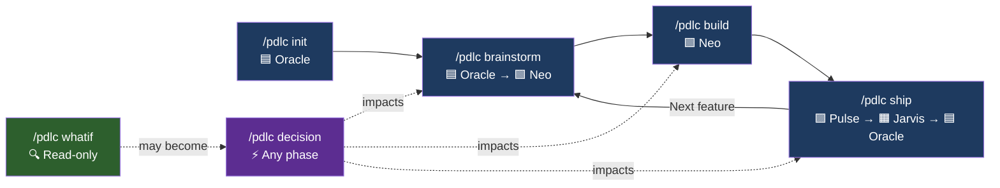

# The PDLC Flow

### Summary

### Detailed flow

```mermaid
flowchart TD
    START([Session Start]) --> RESUME{STATE.md exists?}
    RESUME -->|No| INIT
    RESUME -->|Yes| AUTOLOAD[Auto-resume from\nlast checkpoint\n+ show roadmap progress]
    AUTOLOAD --> PHASE_CHECK{Current phase?}
    PHASE_CHECK -->|Inception| INCEPTION
    PHASE_CHECK -->|Construction| CONSTRUCTION
    PHASE_CHECK -->|Operation| OPERATION

    %% ── PHASE 0: INIT ──────────────────────────────────────────────
    INIT["/pdlc init"] --> GITCHECK{Git repo exists?}
    GITCHECK -->|No| GITINIT[git init + .gitignore\n+ GitHub setup]
    GITCHECK -->|Yes| GHCHECK{GitHub remote?}
    GITINIT --> GHCHECK
    GHCHECK -->|No| GHSETUP[gh CLI auth\n+ repo creation]
    GHCHECK -->|Yes| PREREQ
    GHSETUP --> PREREQ
    PREREQ[Check prereqs\nDolt + Beads] --> FIELD{Existing code?}
    FIELD -->|Brownfield| SCAN[Offer repo scan]
    SCAN -->|Accepted| SCANRUN[Deep-scan codebase\nPresent findings]
    SCANRUN --> MEM
    SCAN -->|Declined| SOC
    FIELD -->|Greenfield| SOC[7 Socratic questions]
    SOC --> MEM[Generate memory files]
    MEM --> ROADMAP[Roadmap Ideation\nOracle brainstorms features\nPrioritize + validate deps]
    ROADMAP --> BDI[bd init]
    BDI --> INITPROMPT{Start first feature?}
    INITPROMPT -->|Yes| INCEPTION
    INITPROMPT -->|No| IDLE1([Idle])

    %% ── PHASE 1: INCEPTION ─────────────────────────────────────────
    INCEPTION["/pdlc brainstorm feature-name"] --> DIVG{Divergent\nideation?}
    DIVG -->|Yes| IDEAS[100+ ideas\nDomain rotation\nCluster → Standouts]
    DIVG -->|No| SOCRATIC
    IDEAS --> SOCRATIC[DISCOVER\n4-round Socratic interview]
    SOCRATIC --> PROGRESSIVE[Progressive Thinking\n🗣 Agent team meeting\n6 rounds · Oracle facilitates]
    PROGRESSIVE --> ADVERSARIAL[Adversarial Review\n10+ findings · Top 5 follow-ups]
    ADVERSARIAL --> EDGE[Edge Case Analysis\n9 categories · path tracing]
    EDGE --> DSUM[Discovery summary]
    DSUM --> DCONF{Human confirms?}
    DCONF -->|Adjust| DSUM
    DCONF -->|Confirmed| PRD[DEFINE\nAuto-generate PRD]
    PRD --> PRDGATE{Approve PRD?}
    PRDGATE -->|Revise| PRD
    PRDGATE -->|Approved| BLOOMS[DESIGN\nBloom's Taxonomy questioning\n6 rounds · Neo leads]
    BLOOMS --> DESIGNDOCS[Generate design docs\nARCHITECTURE · data-model\napi-contracts]
    DESIGNDOCS --> DGATE{Approve design?}
    DGATE -->|Revise| DESIGNDOCS
    DGATE -->|Approved| PLAN[PLAN\nBeads tasks + dependencies]
    PLAN --> PGATE{Approve plan?}
    PGATE -->|Revise| PLAN
    PGATE -->|Approved| INCPROMPT{Start building?}
    INCPROMPT -->|Yes| CONSTRUCTION
    INCPROMPT -->|No| IDLE2([Idle])

    %% ── PHASE 2: CONSTRUCTION ──────────────────────────────────────
    CONSTRUCTION["/pdlc build"] --> BPRE[Load state\nCreate feature branch]
    BPRE --> READY{bd ready?}
    READY -->|No tasks| REVIEW
    READY -->|2+ tasks| WAVE[🗣 Wave Kickoff]
    READY -->|1 task| PICK
    WAVE --> PICK[Select task]
    PICK --> CLAIM[Claim task]
    CLAIM --> ROUNDTABLE{Complex?}
    ROUNDTABLE -->|Yes| DROUND[🗣 Design Roundtable]
    ROUNDTABLE -->|No| TDD
    DROUND --> TDD[TDD: Red → Green → Refactor]
    TDD --> TPASS{Tests pass?}
    TPASS -->|Fail 1-2| TDD
    TPASS -->|Fail 3| STRIKE[🗣 Strike Panel]
    STRIKE -->|Fix chosen| TDD
    STRIKE -->|Human takes wheel| GUIDE[Human guides] --> TDD
    TPASS -->|Pass| TASKDONE[bd done · Commit]
    TASKDONE --> READY

    REVIEW[🗣 Party Review] --> RFILE[REVIEW file]
    RFILE --> RGATE{Approve?}
    RGATE -->|Fix| REVIEW
    RGATE -->|Approve| TEST[TEST\n6 layers]
    TEST --> TGATE{Gates pass?}
    TGATE -->|Fail| TFAIL{Human decides}
    TFAIL --> TGATE
    TGATE -->|Pass| EPIDRAFT[Draft episode]
    EPIDRAFT --> BUILDPROMPT{Ship now?}
    BUILDPROMPT -->|Yes| OPERATION
    BUILDPROMPT -->|No| IDLE3([Idle])

    %% ── PHASE 3: OPERATION ─────────────────────────────────────────
    OPERATION["/pdlc ship"] --> SGATE{Confirm merge?}
    SGATE -->|Yes| MERGE[Merge to main\nCHANGELOG · semver tag]
    MERGE --> CICD[CI/CD trigger]
    CICD --> SMOKE[VERIFY\nSmoke tests + sign-off]
    SMOKE --> RETRO[REFLECT\nRetro · Episode · ROADMAP update]
    RETRO --> NEXTFEAT{Next feature?}
    NEXTFEAT -->|Continue| INCEPTION
    NEXTFEAT -->|Pause| IDLE4([Idle])
    NEXTFEAT -->|Switch| INCEPTION

    %% ── STYLE ──────────────────────────────────────────────────────
    style STRIKE fill:#ff4444,color:#fff
    style PROGRESSIVE fill:#5c2d91,color:#fff
    style WAVE fill:#5c2d91,color:#fff
    style DROUND fill:#5c2d91,color:#fff
    style REVIEW fill:#5c2d91,color:#fff
    style SGATE fill:#f0a500,color:#fff
    style PRDGATE fill:#f0a500,color:#fff
    style DGATE fill:#f0a500,color:#fff
    style PGATE fill:#f0a500,color:#fff
    style RGATE fill:#f0a500,color:#fff
    style NEXTFEAT fill:#f0a500,color:#fff
```

Legend: 🗣 = team meeting (purple) · ⚠ = approval gate (amber) · 🔴 = escalation (red)

### Approval gates

PDLC stops and waits for explicit human approval at eight checkpoints:

| Gate | When |
|------|------|
| Discovery summary | Before PRD is drafted |
| PRD | Before Design begins |
| Design docs | Before task planning begins |
| Task plan | Before Construction begins |
| Review file | Before PR comments are posted |
| Merge to main | Before merging feature branch |
| Smoke tests | Before marking deployment complete |
| Episode file | Before committing to repo |

---

← [Back to README](../../README.md) | [Next: Feature Highlights →](02-feature-highlights.md)
