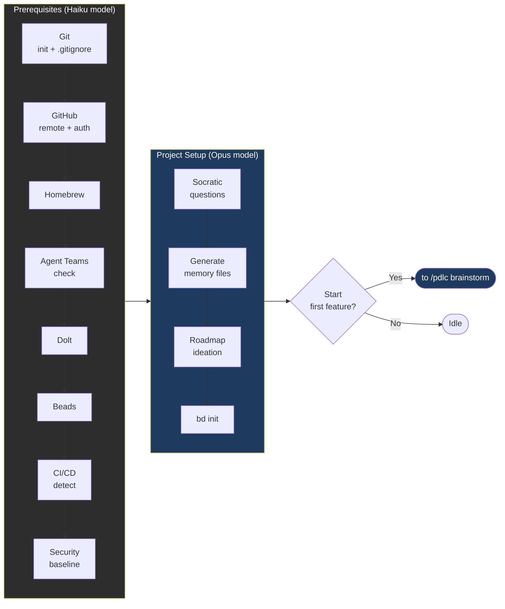
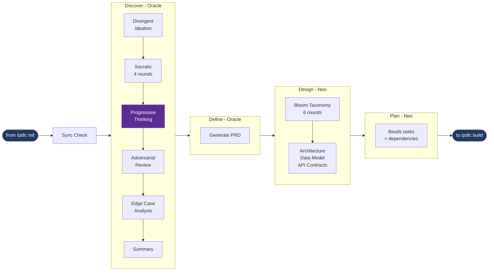
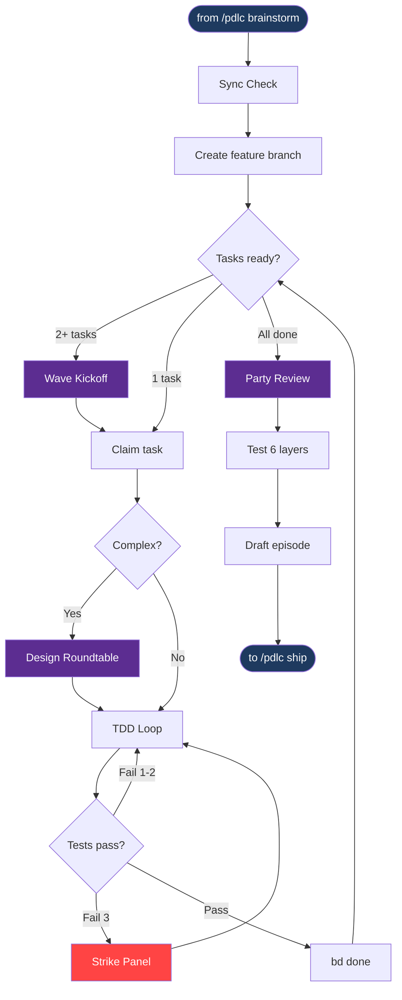
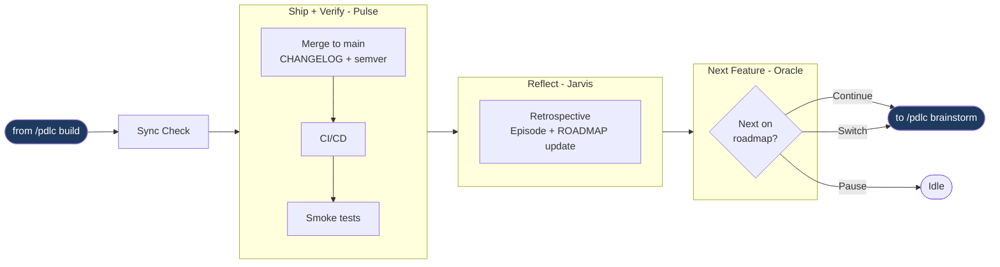

# Phases in Detail

### Phase 0 -- Initialization (`/pdlc init`)

Run once per project. **Oracle** leads.

**Prerequisites (Steps 1a-1e, Haiku model):** These use the Haiku model for speed — they're straightforward CLI operations. The install chain follows dependency order:
1. **Git** — init repo + `.gitignore` if needed
2. **GitHub** — remote + connectivity + `gh` CLI (flagged for install if missing)
2b. **Agent Teams** — check if enabled in Claude Code settings; offer to enable; fallback to Subagent mode if declined
3. **Homebrew** — install if missing on macOS (needed for Dolt, gh); optional on Linux
4. **Dolt** — SQL database for Beads (`brew install dolt` or official script)
5. **Beads** — task manager (`npm install -g @beads/bd`)
6. **CI/CD detection** — checks for GitHub Actions, npm deploy, Makefile, etc. Informational only — if not found, Pulse will help set it up during `/pdlc ship`
7. **Baseline security scan** — `npm audit` for dependency vulnerabilities + secret scan for hardcoded credentials. Informational — surfaces pre-existing issues before any features are built

After prerequisites, Oracle switches to **Opus model** for the rest of init.

**Greenfield** (empty repo): PDLC asks 7 Socratic questions and scaffolds memory files from your answers.

**Brownfield** (existing code): PDLC offers to deep-scan the repository, mapping structure, reading key files, analyzing tests and git history. Scan findings are presented for approval, then used to pre-populate memory files. All inferred content is marked `(inferred -- please verify)`.

**Roadmap Ideation**: Oracle brainstorms 5-15 candidate features, validates priority sequence for dependency conflicts, and captures the backlog in `ROADMAP.md` with permanent `F-NNN` IDs. Auto-launches the first priority feature on confirmation.

**PDLC scaffolds:** CONSTITUTION, INTENT, STATE, ROADMAP, DECISIONS, CHANGELOG, OVERVIEW, episodes/index, and `.beads/`.

### Phase 1 -- Inception (`/pdlc brainstorm <feature>`)

Starts with a **remote sync check** — if local main is behind origin, a team meeting assesses the remote changes before proceeding. Oracle leads Discover + Define, then hands off to Neo for Design + Plan. The feature's ROADMAP.md status is set to `In Progress` when brainstorm begins.

| Sub-phase | Lead | Key activities | Output |
|-----------|------|---------------|--------|
| **Discover** | Oracle | Divergent ideation (optional), Socratic interview (4 rounds), **Progressive Thinking** (required agent meeting), Adversarial review, Edge case analysis | Confirmed discovery summary |
| **Define** | Oracle | Auto-generate PRD from brainstorm log | `PRD_[feature]_[date].md` |
| **Design** | Neo | Bloom's Taxonomy questioning (6 rounds), Architecture + data model + API contracts | `docs/pdlc/design/[feature]/` |
| **Plan** | Neo | Beads tasks with dependencies, dependency graph | Plan file |

### Phase 2 -- Construction (`/pdlc build`)

**Neo** leads the entire phase.

| Sub-phase | Meetings | What happens |
|-----------|----------|-------------|
| **Build** | Wave Kickoff, Design Roundtable, Strike Panel | TDD per task. Wave standup for 2+ tasks. Optional roundtable for complex tasks. 3-strike cap. |
| **Review** | Party Review | Neo, Echo, Phantom, Jarvis in parallel with cross-talk. Critical findings gate. Phantom security sign-off. Deferred findings via Decision Review. |
| **Test** | -- | 7 layers (Unit, Integration, E2E, Perf, A11y, Visual Regression, **Security**). Layer 7 always runs: dependency audit, secret scan on diff, OWASP check. |

### Phase 3 -- Operation (`/pdlc ship`)

| Sub-phase | Lead | What happens |
|-----------|------|-------------|
| **Ship** | Pulse | Remote sync check, merge commit to main, CHANGELOG entry, semantic version tag, CI/CD trigger. If no pipeline exists, offers to scaffold GitHub Actions or npm deploy script. |
| **Verify** | Pulse | Pre-deploy security check (dependency audit + secret scan + security headers), smoke tests against deployed environment + human sign-off |
| **Reflect** | Jarvis | Per-agent retro, metrics, episode finalization, ROADMAP.md marked `Shipped`, METRICS.md updated with trend summary, artifacts archived, Beads compacted |
| **Next Feature** | Oracle | Reviews roadmap, presents next priority. **Continue**, **pause**, or **switch** |

### Abandoning a feature with `/pdlc abandon`

If a feature is discovered to be unviable mid-inception or mid-build, abandon it cleanly. Oracle leads.

| Step | What happens |
|------|-------------|
| **Confirm** | User explains why the feature is being abandoned |
| **Record** | ADR entry in DECISIONS.md with reason, work completed, phase reached |
| **Close tasks** | All open Beads tasks for the feature closed with abandonment note |
| **Update ROADMAP** | Status set to `Dropped` with date and episode reference |
| **Episode** | Compact abandonment episode with reason, work completed, lessons learned |
| **Preserve** | PRD, design docs, brainstorm log, and feature branch kept for reference (not deleted) |
| **Next feature** | Oracle presents next roadmap item — continue, pause, or switch |

Abandonment is permanent in ROADMAP.md. To revisit the feature later, add it as a new entry with a new `F-NNN` ID.

### Pausing and resuming with `/pdlc pause` and `/pdlc resume`

You can explicitly pause the current feature at any point and resume it later.

**Pause (`/pdlc pause`):**
- Saves full state to `.paused-feature.json` (phase, sub-phase, active task, checkpoint, branch)
- Unclaims the active Beads task (returns to ready queue)
- Sets STATE.md to `Idle — Paused`
- ROADMAP.md stays `In Progress` (work will resume)

**Resume (`/pdlc resume`):**
- Checks for changes to main since the pause (teammate commits, hotfixes)
- Rebases the feature branch on main if needed
- **Reclaims the Beads task** that was active at pause time (or picks the next ready task if the original was completed)
- Restores STATE.md from the snapshot
- Lead agent announces any changes since the pause before continuing

Only one feature can be paused at a time. To switch features: pause one, work on another, then resume the first.

### Emergency hotfix with `/pdlc hotfix <name>`

When production is on fire and can't wait for the normal feature cycle. Pulse leads.

| Step | What happens |
|------|-------------|
| **Pause** | Current feature's full state saved to `.paused-feature.json`. Active Beads task unclaimed. Automatic — no confirmation needed. |
| **Sync + Branch** | Remote sync check, then `hotfix/[name]` created from current main |
| **Describe** | User describes the issue (3 questions: what's broken, suspected cause, severity) |
| **Build** | TDD enforced (failing test → fix → pass). No Party Review — just Phantom + Echo security check. 3-strike rule applies. |
| **Ship** | Merge to main, patch version bump, deploy trigger |
| **Verify** | Expedited: health check + specific reproduction check + user confirmation |
| **Impact** | Diff the hotfix against the paused feature branch. Rebase if overlap. Neo + Echo assess if design/tests need updating. |
| **Resume** | Restore STATE.md from snapshot, switch to feature branch, announce context, re-invoke the paused phase skill |

The paused feature's state is captured in `.paused-feature.json` (phase, sub-phase, active task, checkpoint, branch). On resume, the feature branch is rebased on main (which now includes the hotfix) and any impact is reported to the lead agent before continuing.

### Rolling back with `/pdlc rollback [feature]`

If a shipped feature needs to be reverted (production incident, critical bug, failed smoke tests discovered late):

| Step | What happens |
|------|-------------|
| **Sync + Revert** | Remote sync check, then `git revert` of the merge commit, push to origin, rollback tag |
| **State update** | ROADMAP set to `Rolled Back`, CHANGELOG rollback entry, episode file updated |
| **Post-Mortem Party** | Oracle leads all 9 agents through 3 rounds: root cause diagnosis → cross-examination → fix proposals |
| **Options** | **Fix and re-ship** (3 ranked approaches with effort/risk), **Abandon** (drop feature, move to next), or **Pause** |

The post-mortem meeting is required — it cannot be skipped. Every rollback produces an ADR entry and a MOM file.

### Pivoting with `/pdlc decision <text>`

Use `/pdlc decision` to **pivot** the design mid-flight -- change tech stack, rearchitect a component, alter scope, switch databases, or any other significant change. Available at any point during Inception, Construction, or Operation. The lead agent for the current phase runs the flow:

| Step | What happens |
|------|-------------|
| **Checkpoint** | Pauses current workflow, saves recovery state |
| **Classify** | Tag source (user vs PDLC flow), phase, sub-phase, agent |
| **Decision Review Party** | All 9 agents assess impacts on their owned artifacts |
| **MOM** | Minutes with assessments, cross-cutting concerns, risk consensus, roadmap resequencing proposal |
| **User approval** | Recommended changes table. Apply all, selectively, modify, or cancel |
| **Reconciliation** | Beads tasks, PRDs, design docs, episode drafts, test flags, roadmap all updated |
| **Resume** | Returns to the paused checkpoint with updated context |

Feature IDs (`F-NNN`) are permanent. Priority is a separate column -- resequencing never renumbers IDs or ADRs.

### Scenario planning with `/pdlc whatif <scenario>`

Use `/pdlc whatif` for **scenario planning** -- explore hypothetical changes without committing. The full team analyzes feasibility, effort, risks, and trade-offs in a read-only meeting. No files are modified.

| Outcome | What happens |
|---------|-------------|
| **Explore further** | Drill deeper into a specific aspect -- versioned MOM |
| **Accept as decision** | Converts to formal decision, reuses the What-If MOM (no duplicate meeting), runs decision workflow for reconciliation |
| **Discard** | Files the MOM for reference, resumes paused workflow |

Together, `/pdlc decision` and `/pdlc whatif` give you a full **pivot and scenario planning toolkit**: explore ideas safely with whatif, then commit to them with decision when ready.

---

[← Previous: Feature Highlights](02-feature-highlights.md) | [Back to README](../../README.md) | [Next: Doctor →](04-doctor.md)
