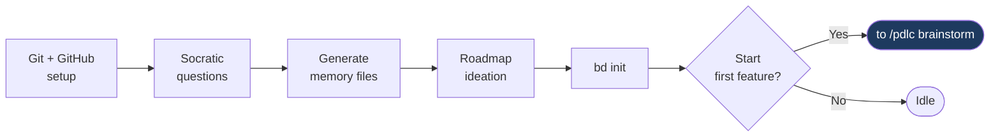
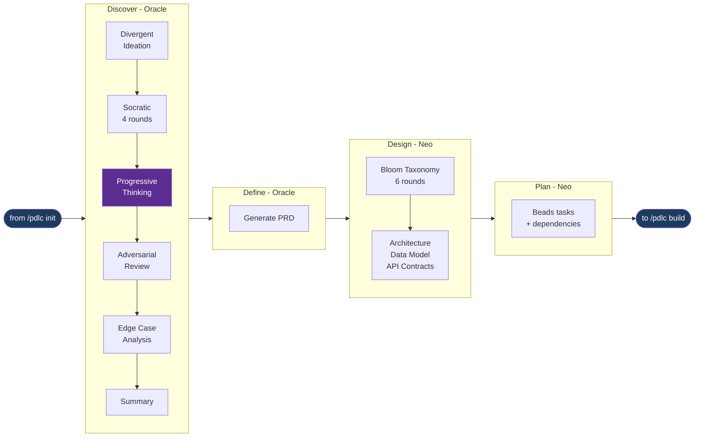
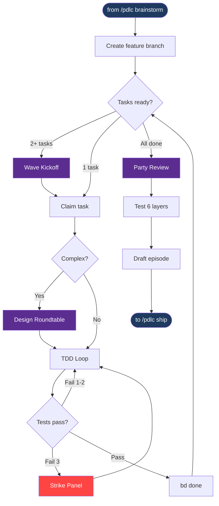
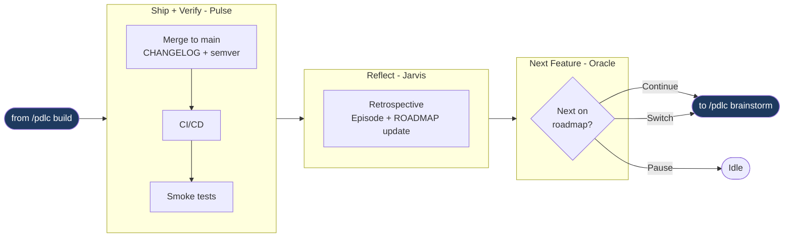

# Phases in Detail

### Phase 0 -- Initialization (`/pdlc init`)

Run once per project. **Oracle** leads. PDLC checks prerequisites, then detects whether you're starting fresh or bringing in an existing codebase.

**Git & GitHub setup**: If no git repo exists, PDLC offers to initialize one with a `.gitignore` (node_modules, .claude, .env, etc.). Then verifies GitHub connectivity — if no remote is configured, walks you through creating a repo (GitHub.com or GitHub Enterprise) and authenticating with the `gh` CLI. This ensures `/pdlc ship` can create PRs without issues later.

**Greenfield** (empty repo): PDLC asks 7 Socratic questions and scaffolds memory files from your answers.

**Brownfield** (existing code): PDLC offers to deep-scan the repository, mapping structure, reading key files, analyzing tests and git history. Scan findings are presented for approval, then used to pre-populate memory files. All inferred content is marked `(inferred -- please verify)`.

**Roadmap Ideation**: Oracle brainstorms 5-15 candidate features, validates priority sequence for dependency conflicts, and captures the backlog in `ROADMAP.md` with permanent `F-NNN` IDs. Auto-launches the first priority feature on confirmation.

**PDLC scaffolds:** CONSTITUTION, INTENT, STATE, ROADMAP, DECISIONS, CHANGELOG, OVERVIEW, episodes/index, and `.beads/`.

### Phase 1 -- Inception (`/pdlc brainstorm <feature>`)

Oracle leads Discover + Define, then hands off to Neo for Design + Plan. The feature's ROADMAP.md status is set to `In Progress` when brainstorm begins.

| Sub-phase | Lead | Key activities | Output |
|-----------|------|---------------|--------|
| **Discover** | Oracle | Divergent ideation (optional), Socratic interview (4 rounds), **Progressive Thinking** (required agent meeting), Adversarial review, Edge case analysis | Confirmed discovery summary |
| **Define** | Oracle | Auto-generate PRD from brainstorm log | `PRD_[feature]_[date].md` |
| **Design** | Neo | Bloom's Taxonomy questioning (6 rounds), Architecture + data model + API contracts | `docs/pdlc/design/[feature]/` |
| **Plan** | Neo | Beads tasks with dependencies, dependency graph | Plan file |

### Phase 2 -- Construction (`/pdlc build`)

**Neo** leads the entire phase.

| Sub-phase | Meetings | What happens |
|-----------|----------|-------------|
| **Build** | Wave Kickoff, Design Roundtable, Strike Panel | TDD per task. Wave standup for 2+ tasks. Optional roundtable for complex tasks. 3-strike cap. |
| **Review** | Party Review | Neo, Echo, Phantom, Jarvis in parallel with cross-talk. Critical findings gate. Deferred findings via Decision Review. |
| **Test** | -- | 6 layers. Constitution gates determine required. Human decides on failures. |

### Phase 3 -- Operation (`/pdlc ship`)

| Sub-phase | Lead | What happens |
|-----------|------|-------------|
| **Ship** | Pulse | Merge commit to main, CHANGELOG entry, semantic version tag, CI/CD trigger |
| **Verify** | Pulse | Smoke tests against deployed environment + human sign-off |
| **Reflect** | Jarvis | Per-agent retro, metrics, episode finalization, ROADMAP.md marked `Shipped` |
| **Next Feature** | Oracle | Reviews roadmap, presents next priority. **Continue**, **pause**, or **switch** |

### Pivoting with `/pdlc decision <text>`

Use `/pdlc decision` to **pivot** the design mid-flight -- change tech stack, rearchitect a component, alter scope, switch databases, or any other significant change. Available at any point during Inception, Construction, or Operation. The lead agent for the current phase runs the flow:

| Step | What happens |
|------|-------------|
| **Checkpoint** | Pauses current workflow, saves recovery state |
| **Classify** | Tag source (user vs PDLC flow), phase, sub-phase, agent |
| **Decision Review Party** | All 9 agents assess impacts on their owned artifacts |
| **MOM** | Minutes with assessments, cross-cutting concerns, risk consensus, roadmap resequencing proposal |
| **User approval** | Recommended changes table. Apply all, selectively, modify, or cancel |
| **Reconciliation** | Beads tasks, PRDs, design docs, episode drafts, test flags, roadmap all updated |
| **Resume** | Returns to the paused checkpoint with updated context |

Feature IDs (`F-NNN`) are permanent. Priority is a separate column -- resequencing never renumbers IDs or ADRs.

### Scenario planning with `/pdlc whatif <scenario>`

Use `/pdlc whatif` for **scenario planning** -- explore hypothetical changes without committing. The full team analyzes feasibility, effort, risks, and trade-offs in a read-only meeting. No files are modified.

| Outcome | What happens |
|---------|-------------|
| **Explore further** | Drill deeper into a specific aspect -- versioned MOM |
| **Accept as decision** | Converts to formal decision, reuses the What-If MOM (no duplicate meeting), runs decision workflow for reconciliation |
| **Discard** | Files the MOM for reference, resumes paused workflow |

Together, `/pdlc decision` and `/pdlc whatif` give you a full **pivot and scenario planning toolkit**: explore ideas safely with whatif, then commit to them with decision when ready.

---

← [Back to README](../../README.md)
